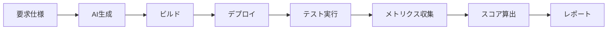

# Req2Run Benchmark

**要求仕様からの自動コード生成を評価する標準ベンチマーク**

[](https://opensource.org/licenses/MIT)
[](https://github.com/itdojp/req2run-benchmark)
[]()

## 概要

Req2Run（Requirements to Running Code）は、AI/LLMシステムの実装能力を定量的に評価するためのベンチマークフレームワークです。詳細な要求仕様から実動するコードを生成し、自動評価を行います。

## 特徴

- 🎯 **包括的な問題セット**: Web API、暗号化、ネットワークプロトコル、データ処理など15以上のカテゴリ
- 🤖 **完全自動評価**: 人間の介入なしで生成から評価まで実行
- 📊 **定量的メトリクス**: 機能充足率、性能、セキュリティ、コード品質を測定
- 🔧 **標準化された環境**: Docker/Kubernetes上での統一実行環境
- 📈 **難易度レベル**: Basic、Intermediate、Advanced、Expertの4段階

## クイックスタート

### 前提条件

- Docker 24.0+
- Kubernetes 1.28+ (オプション)
- Python 3.11+
- Git

### インストール

```bash
# リポジトリのクローン
git clone https://github.com/itdojp/req2run-benchmark.git
cd req2run-benchmark

# 依存関係のインストール
pip install -r requirements.txt

# 環境セットアップ
./scripts/setup/init.sh
```

### 基本的な使用方法

```bash
# 単一問題の評価実行
python -m req2run evaluate --problem WEB-001 --submission ./submissions/my_solution

# バッチ評価の実行
python -m req2run batch-evaluate --difficulty intermediate --output ./results

# レポート生成
python -m req2run report --results ./results --format html
```

## 問題カテゴリ

| カテゴリ | 説明 | 問題数 |
|---------|------|--------|
| `web_api` | RESTful API実装 | 3 |
| `cli_tool` | CLIツール開発 | 2 |
| `network_protocol` | カスタムプロトコル | 2 |
| `cryptography` | 暗号化ツール | 2 |
| `data_processing` | データパイプライン | 2 |
| `system_utility` | システムユーティリティ | 2 |
| `machine_learning` | ML パイプライン | 1 |
| `database` | データベース実装 | 2 |

## 評価フロー



## ディレクトリ構成

```
req2run-benchmark/
├── problems/           # 問題定義（YAML）
│   ├── basic/         # 基礎レベル問題
│   ├── intermediate/  # 中級レベル問題
│   ├── advanced/      # 上級レベル問題
│   └── expert/        # エキスパートレベル問題
├── evaluation/        # 評価フレームワーク
│   ├── harness/      # テストハーネス
│   ├── metrics/      # メトリクス計算
│   └── reports/      # レポート生成
├── infrastructure/    # インフラ設定
│   ├── docker/       # Dockerコンテナ
│   ├── kubernetes/   # K8sマニフェスト
│   └── terraform/    # IaC設定
├── scripts/          # ユーティリティスクリプト
├── tests/            # テストスイート
└── docs/             # ドキュメント
```

## 評価基準

各問題は以下の基準で評価されます：

- **機能要件充足率** (30-40%)
- **テストケース通過率** (20-30%)
- **性能要件達成** (10-20%)
- **コード品質** (10-20%)
- **セキュリティ** (10-20%)

合格基準：総合スコア ≥ 70%

## API利用

```python
from req2run import Evaluator, Problem

# 問題のロード
problem = Problem.load("WEB-001")

# 評価器の初期化
evaluator = Evaluator(
    problem=problem,
    environment="docker",
    timeout=3600
)

# 評価実行
result = evaluator.evaluate(
    submission_path="./my_solution",
    verbose=True
)

# 結果の取得
print(f"Score: {result.score}")
print(f"Status: {result.status}")
```

## 貢献方法

1. このリポジトリをフォーク
2. フィーチャーブランチを作成 (`git checkout -b feature/NewProblem`)
3. 変更をコミット (`git commit -m 'Add new problem category'`)
4. ブランチにプッシュ (`git push origin feature/NewProblem`)
5. プルリクエストを作成

詳細は [CONTRIBUTING.md](docs/CONTRIBUTING.md) を参照してください。

## ライセンス

このプロジェクトはMITライセンスの下で公開されています。詳細は [LICENSE](LICENSE) ファイルを参照してください。

## 連絡先

- プロジェクトリーダー: IT Dojo Japan
- Email: contact@itdojp.com
- Issue Tracker: [GitHub Issues](https://github.com/itdojp/req2run-benchmark/issues)

## 謝辞

このプロジェクトは、AI/LLMコミュニティの貢献により実現しています。

---

**Note**: このベンチマークは継続的に改善されています。最新情報は [リリースノート](https://github.com/itdojp/req2run-benchmark/releases) をご確認ください。