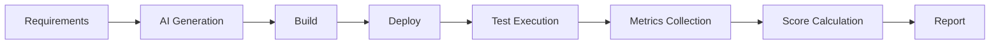
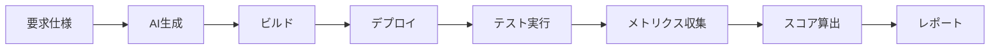

# Req2Run Benchmark

[English](#english) | [日本語](#japanese)

---

<a id="english"></a>
## English

**A comprehensive benchmark framework for evaluating AI code generation systems from requirements to running code**

[](https://opensource.org/licenses/MIT)
[](https://github.com/itdojp/req2run-benchmark)
[]()

### Overview

Req2Run (Requirements to Running Code) is a benchmark framework for quantitatively evaluating the implementation capabilities of AI/LLM systems. It generates working code from detailed requirement specifications and performs automated evaluation.

### Features

- 🎯 **Comprehensive Problem Set**: 35 problems across 16+ categories including Web APIs, cryptography, network protocols, data processing
- 🤖 **Fully Automated Evaluation**: Execution from generation to evaluation without human intervention
- 📊 **Quantitative Metrics**: Measures functional coverage, performance, security, and code quality
- 🔧 **Standardized Environment**: Unified execution environment on Docker/Kubernetes
- 📈 **Difficulty Levels**: Four levels - Basic (1), Intermediate (8), Advanced (17), Expert (9)
- 🌐 **Full Internationalization**: Complete documentation available in English and Japanese

### Quick Start

#### Prerequisites

- Python 3.9+ (3.11 recommended)
- Docker 24.0+ (optional but recommended)
- Git

#### Environment Setup

```bash
# Clone the repository
git clone https://github.com/itdojp/req2run-benchmark.git
cd req2run-benchmark

# Quick setup with helper script
# Linux/Mac:
./scripts/setup-env.sh

# Windows PowerShell:
.\scripts\setup-env.ps1

# Windows CMD:
scripts\setup-env.bat
```

For detailed setup instructions, see [Environment Setup Guide](docs/ENVIRONMENT_SETUP.md).

#### Using Docker (Recommended)

```bash
# Build Docker image with all dependencies
docker build -t req2run-benchmark .

# Run in Docker container
docker run -it -v $(pwd):/workspace req2run-benchmark bash

# Or use docker-compose for development
docker-compose -f docker-compose.dev.yml up
```

#### Manual Installation

```bash
# Create virtual environment
python -m venv venv

# Activate virtual environment
source venv/bin/activate  # Linux/Mac
# or
venv\Scripts\activate.bat  # Windows

# Install dependencies
pip install -r requirements.txt
```

If you encounter dependency issues, see [Dependency Troubleshooting Guide](docs/DEPENDENCY_TROUBLESHOOTING.md).

#### Basic Usage

```bash
# Evaluate a single problem
python -m req2run evaluate --problem WEB-001 --submission ./submissions/my_solution

# Run batch evaluation
python -m req2run batch-evaluate --difficulty intermediate --output ./results

# Generate report
python -m req2run report --results ./results --format html
```

### Problem Categories

| Category | Description | Count |
|----------|-------------|-------|
| `web_api` | RESTful APIs, GraphQL, WebSockets | 7 |
| `database` | In-memory, time-series, event sourcing | 4 |
| `cli_tool` | CLI tools, TUI dashboards, job orchestrators | 3 |
| `network_protocol` | TCP/UDP, reverse proxy, gRPC | 3 |
| `cryptography` | Encryption, ZKP, homomorphic | 3 |
| `data_processing` | Stream processing, ETL, CDC | 3 |
| `authentication` | OAuth, RBAC/ABAC | 2 |
| `machine_learning` | ML pipelines with serving | 1 |
| `language_processor` | SQL interpreter | 1 |
| `real_time_communication` | WebRTC video conferencing | 1 |
| `blockchain` | Smart contract platform | 1 |
| `orchestration` | Container orchestration | 1 |
| `api_gateway` | GraphQL federation | 1 |
| `runtime_platform` | Serverless runtime | 1 |
| `service_mesh` | Service mesh control plane | 1 |
| `observability` | OpenTelemetry tracing | 1 |

### Evaluation Flow



### Directory Structure

```
req2run-benchmark/
├── problems/           # Problem definitions (YAML)
│   ├── basic/         # Basic level problems
│   ├── intermediate/  # Intermediate level problems
│   ├── advanced/      # Advanced level problems
│   └── expert/        # Expert level problems
├── evaluation/        # Evaluation framework
│   ├── harness/      # Test harness
│   ├── metrics/      # Metrics calculation
│   └── reports/      # Report generation
├── infrastructure/    # Infrastructure configs
│   ├── docker/       # Docker containers
│   ├── kubernetes/   # K8s manifests
│   └── terraform/    # IaC configurations
├── scripts/          # Utility scripts
├── tests/            # Test suite
└── docs/             # Documentation
```

### Evaluation Criteria

Each problem is evaluated based on:

- **Functional Coverage** (30-40%)
- **Test Pass Rate** (20-30%)
- **Performance** (10-20%)
- **Code Quality** (10-20%)
- **Security** (10-20%)

Pass Criteria: Total Score ≥ 70%

### API Usage

```python
from req2run import Evaluator, Problem

# Load problem
problem = Problem.load("WEB-001")

# Initialize evaluator
evaluator = Evaluator(
    problem=problem,
    environment="docker",
    timeout=3600
)

# Run evaluation
result = evaluator.evaluate(
    submission_path="./my_solution",
    verbose=True
)

# Get results
print(f"Score: {result.score}")
print(f"Status: {result.status}")
```

### How Req2Run Differs from Other Benchmarks

> **Req2Run** evaluates *requirements-to-running-code* with **functional + non-functional (performance/security/quality)** metrics in a **unified containerized environment**, complementing function-level benchmarks (HumanEval/MBPP) and code modification benchmarks (SWE-bench).

#### Detailed Comparison

| Benchmark | Focus | Primary Metric | Req2Run Distinction |
|-----------|-------|----------------|--------------------|
| **HumanEval/MBPP** | Function-level coding | Pass@k | Full application + NFR evaluation |
| **SWE-bench** | Issue resolution in repos | %Resolved | New implementation from requirements |
| **EvalPlus** | Test robustness | Enhanced Pass@k | Production deployment readiness |
| **MultiPL-E** | Multi-language | Cross-language Pass@k | Container-based deployment |
| **ArchCode** | Design quality | NFR compliance | Comprehensive NFR scoring |
| **HumanEval-V** | Visual programming | Pass@k with images | Text-based requirements only |

#### Key Differentiators

1. **Requirements-First Approach**: Uses RFC 2119 (MUST/SHOULD/MAY) and EARS syntax for precise requirement specification
2. **Production Readiness**: Evaluates not just correctness but deployment readiness with Docker/Kubernetes
3. **Comprehensive NFR Evaluation**: 
   - Performance: P95/P99 latency, throughput, resource usage
   - Security: Static analysis (Bandit/Semgrep) + runtime sandboxing (nsjail/firejail)
   - Quality: Complexity, coverage, maintainability, documentation
4. **Cost Efficiency Metrics**: Score-per-dollar and score-per-token calculations
5. **Test Augmentation**: Following EvalPlus methodology with property-based and boundary testing
6. **Deterministic Evaluation**: Fixed seeds, versioned metrics, reproducible scoring

#### When to Use Req2Run

- ✅ Evaluating end-to-end implementation capability from requirements
- ✅ Assessing production readiness of generated code
- ✅ Measuring non-functional requirements compliance
- ✅ Benchmarking cost-efficiency of AI systems
- ❌ Quick function-level testing (use HumanEval/MBPP)
- ❌ Bug fixing in existing code (use SWE-bench)

### Contributing

1. Fork this repository
2. Create a feature branch (`git checkout -b feature/NewProblem`)
3. Commit your changes (`git commit -m 'Add new problem category'`)
4. Push to the branch (`git push origin feature/NewProblem`)
5. Create a Pull Request

See [CONTRIBUTING.md](docs/CONTRIBUTING.md) for details.

### License

This project is licensed under the MIT License. See [LICENSE](LICENSE) file for details.

### Contact

- Project Lead: ITdo Inc. Japan
- Email: contact@itdo.jp
- Issue Tracker: [GitHub Issues](https://github.com/itdojp/req2run-benchmark/issues)

### Acknowledgments

This project is made possible by contributions from the AI/LLM community.

---

<a id="japanese"></a>
## 日本語

**要求仕様から実動コードまでAIコード生成システムを評価する包括的ベンチマークフレームワーク**

[](https://opensource.org/licenses/MIT)
[](https://github.com/itdojp/req2run-benchmark)
[]()

### 概要

Req2Run（Requirements to Running Code）は、AI/LLMシステムの実装能力を定量的に評価するためのベンチマークフレームワークです。詳細な要求仕様から実動するコードを生成し、自動評価を行います。

### 特徴

- 🎯 **包括的な問題セット**: 35問題、Web API、暗号化、ネットワークプロトコル、データ処理など16以上のカテゴリ
- 🤖 **完全自動評価**: 人間の介入なしで生成から評価まで実行
- 📊 **定量的メトリクス**: 機能充足率、性能、セキュリティ、コード品質を測定
- 🔧 **標準化された環境**: Docker/Kubernetes上での統一実行環境
- 📈 **難易度レベル**: Basic (1)、Intermediate (8)、Advanced (17)、Expert (9)の4段階
- 🌐 **完全な国際化対応**: 全ドキュメントが英語と日本語で利用可能

### クイックスタート

#### 前提条件

- Python 3.9+ (3.11推奨)
- Docker 24.0+ (オプション、推奨)
- Git

#### 環境セットアップ

```bash
# リポジトリのクローン
git clone https://github.com/itdojp/req2run-benchmark.git
cd req2run-benchmark

# ヘルパースクリプトでクイックセットアップ
# Linux/Mac:
./scripts/setup-env.sh

# Windows PowerShell:
.\scripts\setup-env.ps1

# Windows CMD:
scripts\setup-env.bat
```

詳細なセットアップ手順は[環境セットアップガイド](docs/ENVIRONMENT_SETUP.md)を参照してください。

#### Dockerの使用（推奨）

```bash
# すべての依存関係を含むDockerイメージをビルド
docker build -t req2run-benchmark .

# Dockerコンテナで実行
docker run -it -v $(pwd):/workspace req2run-benchmark bash

# または開発用にdocker-composeを使用
docker-compose -f docker-compose.dev.yml up
```

#### 手動インストール

```bash
# 仮想環境を作成
python -m venv venv

# 仮想環境をアクティベート
source venv/bin/activate  # Linux/Mac
# または
venv\Scripts\activate.bat  # Windows

# 依存関係をインストール
pip install -r requirements.txt
```

依存関係の問題が発生した場合は、[依存関係トラブルシューティングガイド](docs/DEPENDENCY_TROUBLESHOOTING.md)を参照してください。

#### 基本的な使用方法

```bash
# 単一問題の評価実行
python -m req2run evaluate --problem WEB-001 --submission ./submissions/my_solution

# バッチ評価の実行
python -m req2run batch-evaluate --difficulty intermediate --output ./results

# レポート生成
python -m req2run report --results ./results --format html
```

### 問題カテゴリ

| カテゴリ | 説明 | 問題数 |
|---------|------|--------|
| `web_api` | RESTful API実装 | 3 |
| `cli_tool` | CLIツール開発 | 2 |
| `network_protocol` | カスタムプロトコル | 2 |
| `cryptography` | 暗号化ツール | 2 |
| `data_processing` | データパイプライン | 2 |
| `system_utility` | システムユーティリティ | 2 |
| `machine_learning` | ML パイプライン | 1 |
| `database` | データベース実装 | 2 |

### 評価フロー



### ディレクトリ構成

```
req2run-benchmark/
├── problems/           # 問題定義（YAML）
│   ├── basic/         # 基礎レベル問題
│   ├── intermediate/  # 中級レベル問題
│   ├── advanced/      # 上級レベル問題
│   └── expert/        # エキスパートレベル問題
├── evaluation/        # 評価フレームワーク
│   ├── harness/      # テストハーネス
│   ├── metrics/      # メトリクス計算
│   └── reports/      # レポート生成
├── infrastructure/    # インフラ設定
│   ├── docker/       # Dockerコンテナ
│   ├── kubernetes/   # K8sマニフェスト
│   └── terraform/    # IaC設定
├── scripts/          # ユーティリティスクリプト
├── tests/            # テストスイート
└── docs/             # ドキュメント
```

### 評価基準

各問題は以下の基準で評価されます：

- **機能要件充足率** (30-40%)
- **テストケース通過率** (20-30%)
- **性能要件達成** (10-20%)
- **コード品質** (10-20%)
- **セキュリティ** (10-20%)

合格基準：総合スコア ≥ 70%

### API利用

```python
from req2run import Evaluator, Problem

# 問題のロード
problem = Problem.load("WEB-001")

# 評価器の初期化
evaluator = Evaluator(
    problem=problem,
    environment="docker",
    timeout=3600
)

# 評価実行
result = evaluator.evaluate(
    submission_path="./my_solution",
    verbose=True
)

# 結果の取得
print(f"Score: {result.score}")
print(f"Status: {result.status}")
```

### 他のベンチマークとの違い

Req2Runは、AIコード生成評価の中で独自のニッチを埋めています：

| ベンチマーク | 焦点 | 評価方法 |
|------------|------|---------|
| **HumanEval/MBPP** | 関数レベルの短い問題 | Pass@k メトリック |
| **SWE-bench** | 既存コードベースの問題修正 | 解決率（%） |
| **Req2Run** | 要求仕様 → 新規実装 → 本番メトリクス | 機能 + NFR（性能/セキュリティ/品質） |

**主な差別化要因：**
- **エンドツーエンド評価**：要求仕様から本番環境対応コードまで
- **非機能要件**：性能、セキュリティ、コード品質を第一級メトリクスとして扱う
- **統一環境**：Docker/Kubernetes標準化により再現性を保証
- **実践的焦点**：実際の開発タスクを表現する問題設定

### 貢献方法

1. このリポジトリをフォーク
2. フィーチャーブランチを作成 (`git checkout -b feature/NewProblem`)
3. 変更をコミット (`git commit -m 'Add new problem category'`)
4. ブランチにプッシュ (`git push origin feature/NewProblem`)
5. プルリクエストを作成

詳細は [CONTRIBUTING.md](docs/CONTRIBUTING.md) を参照してください。

### ライセンス

このプロジェクトはMITライセンスの下で公開されています。詳細は [LICENSE](LICENSE) ファイルを参照してください。

### 連絡先

- プロジェクトリーダー: ITdo Inc. Japan
- Email: contact@itdo.jp
- Issue Tracker: [GitHub Issues](https://github.com/itdojp/req2run-benchmark/issues)

### 謝辞

このプロジェクトは、AI/LLMコミュニティの貢献により実現しています。

---

**Note**: このベンチマークは継続的に改善されています。最新情報は [リリースノート](https://github.com/itdojp/req2run-benchmark/releases) をご確認ください。 | This benchmark is continuously being improved. Check [Release Notes](https://github.com/itdojp/req2run-benchmark/releases) for the latest updates.
