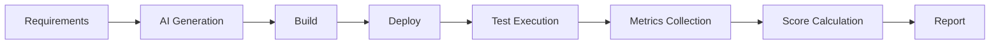
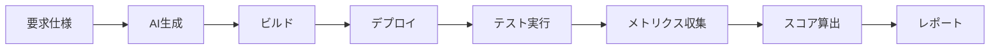

# Req2Run Benchmark

[English](#english) | [日本語](#japanese)

---

<a id="english"></a>
## English

**A comprehensive benchmark framework for evaluating AI code generation systems from requirements to running code**

[](https://opensource.org/licenses/MIT)
[](https://github.com/itdojp/req2run-benchmark)
[]()

### Overview

Req2Run (Requirements to Running Code) is a benchmark framework for quantitatively evaluating the implementation capabilities of AI/LLM systems. It generates working code from detailed requirement specifications and performs automated evaluation.

### Features

- 🎯 **Comprehensive Problem Set**: 15+ categories including Web APIs, cryptography, network protocols, data processing
- 🤖 **Fully Automated Evaluation**: Execution from generation to evaluation without human intervention
- 📊 **Quantitative Metrics**: Measures functional coverage, performance, security, and code quality
- 🔧 **Standardized Environment**: Unified execution environment on Docker/Kubernetes
- 📈 **Difficulty Levels**: Four levels - Basic, Intermediate, Advanced, Expert

### Quick Start

#### Prerequisites

- Docker 24.0+
- Kubernetes 1.28+ (optional)
- Python 3.11+
- Git

#### Installation

```bash
# Clone the repository
git clone https://github.com/itdojp/req2run-benchmark.git
cd req2run-benchmark

# Install dependencies
pip install -r requirements.txt

# Setup environment
./scripts/setup/init.sh
```

#### Basic Usage

```bash
# Evaluate a single problem
python -m req2run evaluate --problem WEB-001 --submission ./submissions/my_solution

# Run batch evaluation
python -m req2run batch-evaluate --difficulty intermediate --output ./results

# Generate report
python -m req2run report --results ./results --format html
```

### Problem Categories

| Category | Description | Count |
|----------|-------------|-------|
| `web_api` | RESTful API implementation | 3 |
| `cli_tool` | CLI tool development | 2 |
| `network_protocol` | Custom protocols | 2 |
| `cryptography` | Encryption tools | 2 |
| `data_processing` | Data pipelines | 2 |
| `system_utility` | System utilities | 2 |
| `machine_learning` | ML pipelines | 1 |
| `database` | Database implementation | 2 |

### Evaluation Flow



### Directory Structure

```
req2run-benchmark/
├── problems/           # Problem definitions (YAML)
│   ├── basic/         # Basic level problems
│   ├── intermediate/  # Intermediate level problems
│   ├── advanced/      # Advanced level problems
│   └── expert/        # Expert level problems
├── evaluation/        # Evaluation framework
│   ├── harness/      # Test harness
│   ├── metrics/      # Metrics calculation
│   └── reports/      # Report generation
├── infrastructure/    # Infrastructure configs
│   ├── docker/       # Docker containers
│   ├── kubernetes/   # K8s manifests
│   └── terraform/    # IaC configurations
├── scripts/          # Utility scripts
├── tests/            # Test suite
└── docs/             # Documentation
```

### Evaluation Criteria

Each problem is evaluated based on:

- **Functional Coverage** (30-40%)
- **Test Pass Rate** (20-30%)
- **Performance** (10-20%)
- **Code Quality** (10-20%)
- **Security** (10-20%)

Pass Criteria: Total Score ≥ 70%

### API Usage

```python
from req2run import Evaluator, Problem

# Load problem
problem = Problem.load("WEB-001")

# Initialize evaluator
evaluator = Evaluator(
    problem=problem,
    environment="docker",
    timeout=3600
)

# Run evaluation
result = evaluator.evaluate(
    submission_path="./my_solution",
    verbose=True
)

# Get results
print(f"Score: {result.score}")
print(f"Status: {result.status}")
```

### Contributing

1. Fork this repository
2. Create a feature branch (`git checkout -b feature/NewProblem`)
3. Commit your changes (`git commit -m 'Add new problem category'`)
4. Push to the branch (`git push origin feature/NewProblem`)
5. Create a Pull Request

See [CONTRIBUTING.md](docs/CONTRIBUTING.md) for details.

### License

This project is licensed under the MIT License. See [LICENSE](LICENSE) file for details.

### Contact

- Project Lead: ITDo Inc. Japan
- Email: contact@itdo.jp
- Issue Tracker: [GitHub Issues](https://github.com/itdojp/req2run-benchmark/issues)

### Acknowledgments

This project is made possible by contributions from the AI/LLM community.

---

<a id="japanese"></a>
## 日本語

**要求仕様から実動コードまでAIコード生成システムを評価する包括的ベンチマークフレームワーク**

[](https://opensource.org/licenses/MIT)
[](https://github.com/itdojp/req2run-benchmark)
[]()

### 概要

Req2Run（Requirements to Running Code）は、AI/LLMシステムの実装能力を定量的に評価するためのベンチマークフレームワークです。詳細な要求仕様から実動するコードを生成し、自動評価を行います。

### 特徴

- 🎯 **包括的な問題セット**: Web API、暗号化、ネットワークプロトコル、データ処理など15以上のカテゴリ
- 🤖 **完全自動評価**: 人間の介入なしで生成から評価まで実行
- 📊 **定量的メトリクス**: 機能充足率、性能、セキュリティ、コード品質を測定
- 🔧 **標準化された環境**: Docker/Kubernetes上での統一実行環境
- 📈 **難易度レベル**: Basic、Intermediate、Advanced、Expertの4段階

### クイックスタート

#### 前提条件

- Docker 24.0+
- Kubernetes 1.28+ (オプション)
- Python 3.11+
- Git

#### インストール

```bash
# リポジトリのクローン
git clone https://github.com/itdojp/req2run-benchmark.git
cd req2run-benchmark

# 依存関係のインストール
pip install -r requirements.txt

# 環境セットアップ
./scripts/setup/init.sh
```

#### 基本的な使用方法

```bash
# 単一問題の評価実行
python -m req2run evaluate --problem WEB-001 --submission ./submissions/my_solution

# バッチ評価の実行
python -m req2run batch-evaluate --difficulty intermediate --output ./results

# レポート生成
python -m req2run report --results ./results --format html
```

### 問題カテゴリ

| カテゴリ | 説明 | 問題数 |
|---------|------|--------|
| `web_api` | RESTful API実装 | 3 |
| `cli_tool` | CLIツール開発 | 2 |
| `network_protocol` | カスタムプロトコル | 2 |
| `cryptography` | 暗号化ツール | 2 |
| `data_processing` | データパイプライン | 2 |
| `system_utility` | システムユーティリティ | 2 |
| `machine_learning` | ML パイプライン | 1 |
| `database` | データベース実装 | 2 |

### 評価フロー



### ディレクトリ構成

```
req2run-benchmark/
├── problems/           # 問題定義（YAML）
│   ├── basic/         # 基礎レベル問題
│   ├── intermediate/  # 中級レベル問題
│   ├── advanced/      # 上級レベル問題
│   └── expert/        # エキスパートレベル問題
├── evaluation/        # 評価フレームワーク
│   ├── harness/      # テストハーネス
│   ├── metrics/      # メトリクス計算
│   └── reports/      # レポート生成
├── infrastructure/    # インフラ設定
│   ├── docker/       # Dockerコンテナ
│   ├── kubernetes/   # K8sマニフェスト
│   └── terraform/    # IaC設定
├── scripts/          # ユーティリティスクリプト
├── tests/            # テストスイート
└── docs/             # ドキュメント
```

### 評価基準

各問題は以下の基準で評価されます：

- **機能要件充足率** (30-40%)
- **テストケース通過率** (20-30%)
- **性能要件達成** (10-20%)
- **コード品質** (10-20%)
- **セキュリティ** (10-20%)

合格基準：総合スコア ≥ 70%

### API利用

```python
from req2run import Evaluator, Problem

# 問題のロード
problem = Problem.load("WEB-001")

# 評価器の初期化
evaluator = Evaluator(
    problem=problem,
    environment="docker",
    timeout=3600
)

# 評価実行
result = evaluator.evaluate(
    submission_path="./my_solution",
    verbose=True
)

# 結果の取得
print(f"Score: {result.score}")
print(f"Status: {result.status}")
```

### 貢献方法

1. このリポジトリをフォーク
2. フィーチャーブランチを作成 (`git checkout -b feature/NewProblem`)
3. 変更をコミット (`git commit -m 'Add new problem category'`)
4. ブランチにプッシュ (`git push origin feature/NewProblem`)
5. プルリクエストを作成

詳細は [CONTRIBUTING.md](docs/CONTRIBUTING.md) を参照してください。

### ライセンス

このプロジェクトはMITライセンスの下で公開されています。詳細は [LICENSE](LICENSE) ファイルを参照してください。

### 連絡先

- プロジェクトリーダー: ITDo Inc. Japan
- Email: contact@itdo.jp
- Issue Tracker: [GitHub Issues](https://github.com/itdojp/req2run-benchmark/issues)

### 謝辞

このプロジェクトは、AI/LLMコミュニティの貢献により実現しています。

---

**Note**: このベンチマークは継続的に改善されています。最新情報は [リリースノート](https://github.com/itdojp/req2run-benchmark/releases) をご確認ください。 | This benchmark is continuously being improved. Check [Release Notes](https://github.com/itdojp/req2run-benchmark/releases) for the latest updates.
