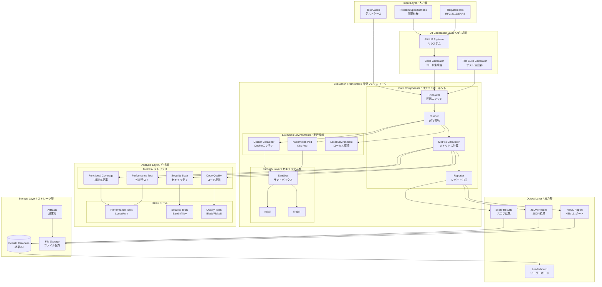
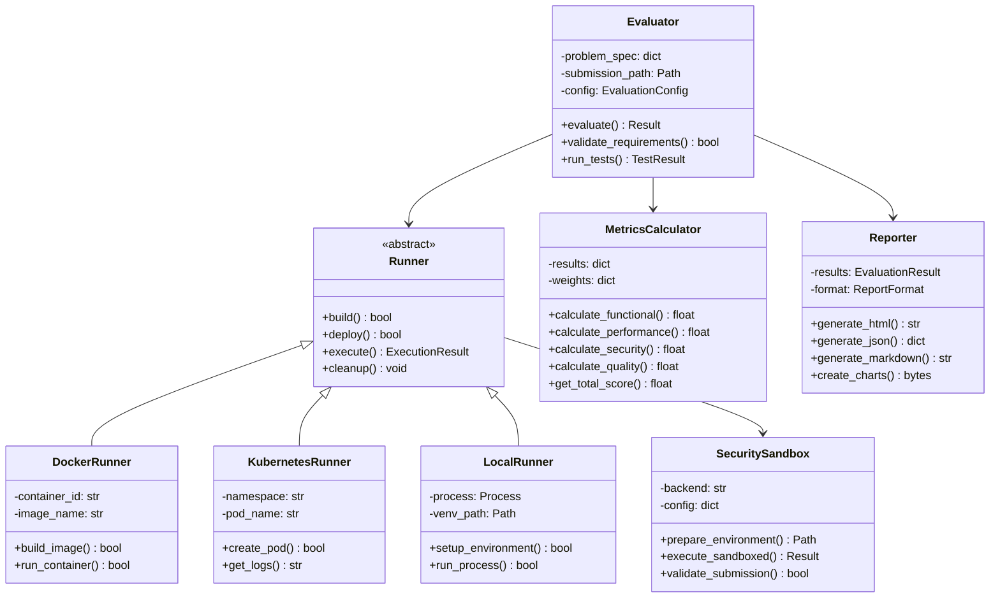
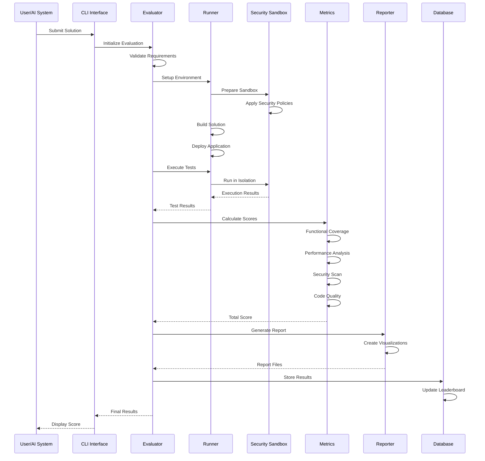
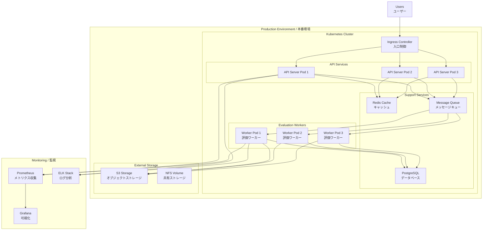
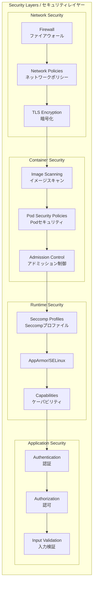

# Req2Run System Architecture
# Req2Run システムアーキテクチャ

## System Overview / システム概要

Req2Run is a comprehensive benchmark framework for evaluating AI code generation systems. It transforms detailed requirement specifications into running code and performs automated evaluation across multiple dimensions.

Req2Runは、AIコード生成システムを評価するための包括的なベンチマークフレームワークです。詳細な要件仕様を実行可能なコードに変換し、複数の次元で自動評価を実行します。

## Architecture Diagram / アーキテクチャ図



## Component Architecture / コンポーネントアーキテクチャ



## Data Flow / データフロー



## System Layers / システムレイヤー

### 1. Input Layer (入力層)

**Components:**
- Problem Specifications (YAML format)
- Requirements (RFC 2119 compliant)
- Test Cases (Unit/Integration/Property)
- Fixtures and Test Data

**Responsibilities:**
- Define evaluation criteria
- Specify functional and non-functional requirements
- Provide test data and expected outputs

### 2. Processing Layer (処理層)

**Components:**
- Evaluator Core Engine
- Execution Runners (Docker/K8s/Local)
- Security Sandbox (nsjail/firejail)
- Metrics Calculators

**Responsibilities:**
- Orchestrate evaluation workflow
- Execute code in isolated environments
- Enforce security policies
- Calculate performance metrics

### 3. Analysis Layer (分析層)

**Components:**
- Performance Analyzers (Locust, wrk, ab)
- Security Scanners (Bandit, Trivy, Safety)
- Code Quality Tools (Black, Flake8, MyPy)
- Test Coverage Tools (pytest-cov)

**Responsibilities:**
- Measure performance characteristics
- Identify security vulnerabilities
- Assess code quality
- Calculate test coverage

### 4. Output Layer (出力層)

**Components:**
- Report Generators (HTML/JSON/Markdown)
- Visualization Tools (matplotlib, charts)
- Leaderboard System
- API Endpoints

**Responsibilities:**
- Generate comprehensive reports
- Create visualizations
- Update leaderboard
- Provide API access to results

## Technology Stack / 技術スタック

```yaml
Core Framework:
  Language: Python 3.11+
  Framework: FastAPI (for API server)
  CLI: Click
  Testing: pytest, hypothesis

Containerization:
  Runtime: Docker 24.0+
  Orchestration: Kubernetes 1.28+
  Registry: Docker Hub / GitHub Container Registry

Security:
  Sandboxing: nsjail, firejail
  Scanning: Bandit, Trivy, Safety
  Policies: Seccomp, AppArmor

Performance:
  Load Testing: Locust, Apache Bench, wrk
  Monitoring: Prometheus, Grafana
  Profiling: cProfile, memory_profiler

Quality:
  Linting: Black, Flake8, Pylint
  Type Checking: MyPy
  Documentation: Sphinx, MkDocs

Storage:
  Database: PostgreSQL 15+ (production), SQLite (development)
  Object Storage: S3-compatible (MinIO, AWS S3)
  Caching: Redis 7.2+

CI/CD:
  Pipeline: GitHub Actions
  Testing: pytest, tox
  Deployment: Helm Charts, ArgoCD
```

## Deployment Architecture / デプロイメントアーキテクチャ



## Security Architecture / セキュリティアーキテクチャ



## Scalability Design / スケーラビリティ設計

- **Horizontal Scaling**: API servers and workers scale independently
- **Queue-based Processing**: Asynchronous evaluation via message queues
- **Caching Strategy**: Multi-layer caching (Redis, CDN, local)
- **Database Sharding**: Partition by problem_id and timestamp
- **Load Balancing**: Round-robin with health checks
- **Auto-scaling**: HPA based on CPU/memory metrics

## High Availability / 高可用性

- **Multi-zone Deployment**: Spread across availability zones
- **Database Replication**: Primary-secondary with automatic failover
- **Circuit Breakers**: Prevent cascade failures
- **Health Checks**: Liveness and readiness probes
- **Backup Strategy**: Daily snapshots with 30-day retention
- **Disaster Recovery**: RTO < 1 hour, RPO < 15 minutes