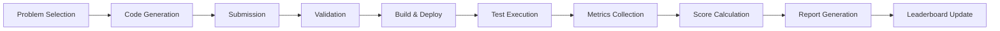
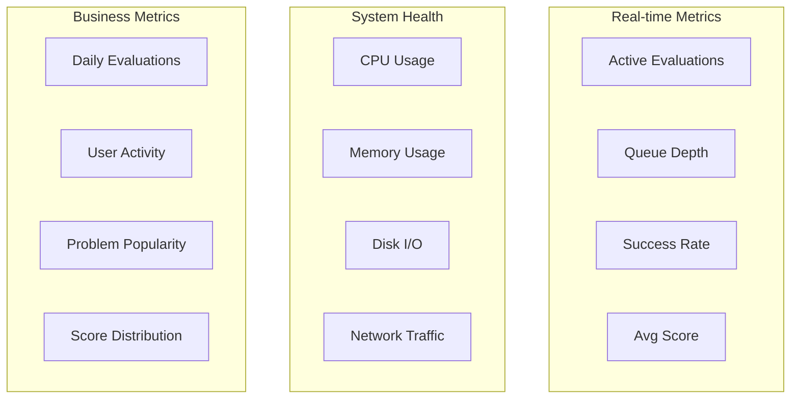

# Req2Run Benchmark System Overview
# Req2Runベンチマークシステム概要

## Executive Summary / エグゼクティブサマリ

Req2Run is a comprehensive benchmark framework designed to evaluate AI code generation systems by assessing their ability to transform detailed requirement specifications into working, production-ready code. The system provides standardized problems across multiple technical domains, automated evaluation pipelines, and detailed scoring mechanisms.

Req2Runは、詳細な要件仕様を動作する本番対応コードに変換する能力を評価することで、AIコード生成システムを評価するために設計された包括的なベンチマークフレームワークです。

## System Purpose / システムの目的

### Primary Goals (主要目標)

1. **Standardized Evaluation**: Provide consistent, reproducible benchmarks for AI code generation
2. **Comprehensive Assessment**: Evaluate not just functional correctness but also performance, security, and code quality
3. **Fair Comparison**: Enable objective comparison between different AI systems
4. **Industry Relevance**: Focus on real-world problems that reflect actual development challenges

### Key Features (主要機能)

- ✍️ **36 Standardized Problems** across various domains
- 🔒 **Secure Execution** with sandboxed environments
- 📊 **Multi-dimensional Scoring** (functional, performance, security, quality)
- 🌐 **Multi-language Support** (Python, JavaScript, Go, Java, Rust)
- 🚀 **Cloud-native Architecture** (Docker, Kubernetes)
- 📈 **Automated Evaluation Pipeline**
- 🏆 **Leaderboard System** with contamination prevention

## Problem Categories / 問題カテゴリ

### Core Problems (コア問題)

| Category | Problem ID | Description | Difficulty |
|----------|------------|-------------|------------|
| Web API | WEB-001 | RESTful API with JWT Authentication | Intermediate |
| CLI Tool | CLI-001 | File Processing Tool | Basic |
| Network Protocol | NET-001 | Custom TCP Protocol Server | Intermediate |
| Cryptography | CRYPTO-001 | File Encryption Utility | Intermediate |
| Data Processing | DATA-001 | Stream Processing Pipeline | Advanced |

### Additional Problems (追加問題)

#### Advanced Level (17 problems)
| Category | Problem ID | Description |
|----------|------------|-------------|
| Machine Learning | ML-001 | ML Pipeline with Model Serving |
| API Gateway | GQL-001 | GraphQL Federation Gateway |
| Runtime Platform | FN-001 | Serverless Function Runtime |
| Database | TS-001 | Time-Series Database |
| Web API | WEB-012, WEB-013, WEB-014 | Advanced Web API Features |
| Authentication | AUTH-010, AUTH-011 | OAuth 2.1/OIDC, RBAC/ABAC |
| Database | DB-010, DB-011 | Money Transfer, Event Sourcing |
| Data Processing | DATA-010, DATA-011 | Stream Processing, CDC |
| Network Protocol | NET-010, NET-011 | Reverse Proxy, gRPC Service Mesh |
| CLI Tool | CLI-011 | Job Orchestrator with DAG |

#### Expert Level (9 problems)
| Category | Problem ID | Description |
|----------|------------|-------------|
| System Utility | SYS-001 | Distributed Task Queue |
| Language Processor | LANG-001 | SQL Query Interpreter |
| Blockchain | CHAIN-001 | Smart Contract Platform |
| Database | DB-001 | In-Memory Database Engine |
| Orchestration | ORCH-001 | Container Orchestration Controller |
| Service Mesh | MESH-001 | Service Mesh Control Plane |
| Cryptography | CRYPTO-010, CRYPTO-011 | Zero-Knowledge Proofs, Homomorphic Encryption |
| Real-time Comm | RTC-001 | WebRTC Video Conference with SFU |

## Evaluation Process / 評価プロセス

### Workflow Overview (ワークフロー概要)



### Evaluation Phases (評価フェーズ)

#### Phase 1: Submission Validation
- Structure verification
- Dependency checking
- Security scanning
- Requirements mapping

#### Phase 2: Build and Deployment
- Container image creation
- Environment setup
- Service initialization
- Health check validation

#### Phase 3: Functional Testing
- Unit test execution
- Integration testing
- API contract validation
- Edge case handling

#### Phase 4: Performance Testing
- Load testing (Locust/wrk)
- Response time measurement
- Throughput analysis
- Resource utilization

#### Phase 5: Security Assessment
- Vulnerability scanning (Trivy/Bandit)
- Dependency audit
- OWASP compliance check
- Runtime behavior analysis

#### Phase 6: Code Quality Review
- Static analysis
- Complexity metrics
- Documentation coverage
- Best practices adherence

## Scoring System / スコアリングシステム

### Score Components (スコア構成要素)

```
Total Score = 35% Functional + 25% Tests + 15% Performance + 15% Quality + 10% Security
```

| Component | Weight | Description | Pass Threshold |
|-----------|--------|-------------|----------------|
| Functional Coverage | 35% | Requirements implementation | 100% (MUST) |
| Test Pass Rate | 25% | Test suite success | 90% |
| Performance | 15% | Speed and efficiency | 70% |
| Code Quality | 15% | Maintainability | 60% |
| Security | 10% | Vulnerability assessment | 80% |

### Score Categories (スコアカテゴリ)

- 🥇 **Gold**: ≥90% - Exceptional implementation
- 🥈 **Silver**: 80-89% - Strong implementation
- 🥉 **Bronze**: 70-79% - Acceptable implementation
- ❌ **Fail**: <70% - Does not meet requirements

## Technical Architecture / 技術アーキテクチャ

### Core Technologies (コア技術)

```yaml
Framework:
  Language: Python 3.11+
  Web: FastAPI
  CLI: Click
  Testing: pytest

Containerization:
  Runtime: Docker 24.0+
  Orchestration: Kubernetes 1.28+
  Registry: GitHub Container Registry

Security:
  Sandbox: nsjail/firejail
  Scanning: Trivy, Bandit
  Policies: Seccomp, AppArmor

Monitoring:
  Metrics: Prometheus
  Visualization: Grafana
  Logging: ELK Stack
```

### System Requirements (システム要件)

#### Minimum Requirements (最小要件)
- CPU: 4 cores
- RAM: 8GB
- Storage: 50GB
- OS: Linux (Ubuntu 22.04+)
- Docker: 24.0+
- Python: 3.11+

#### Recommended Requirements (推奨要件)
- CPU: 8+ cores
- RAM: 16GB+
- Storage: 100GB+ SSD
- Kubernetes cluster
- GPU (for ML problems)

## Security Model / セキュリティモデル

### Defense in Depth (多層防御)

1. **Network Isolation**: No external network access
2. **Container Security**: Read-only filesystems, non-root users
3. **System Call Filtering**: Seccomp profiles
4. **Resource Limits**: CPU, memory, disk quotas
5. **Code Scanning**: Static and dynamic analysis
6. **Dependency Audit**: Vulnerability checking

### Threat Model (脅威モデル)

| Threat | Mitigation |
|--------|------------|
| Malicious code execution | Sandboxed environments |
| Resource exhaustion | Resource limits and timeouts |
| Data exfiltration | Network isolation |
| Privilege escalation | Seccomp and capabilities |
| Supply chain attacks | Dependency scanning |

## Performance Characteristics / パフォーマンス特性

### Evaluation Throughput (評価スループット)

| Problem Type | Avg Time | Concurrency | Daily Capacity |
|--------------|----------|-------------|----------------|
| Beginner | 2-5 min | 10 | ~2,880 |
| Intermediate | 5-15 min | 8 | ~768 |
| Advanced | 15-30 min | 5 | ~240 |
| Expert | 30-60 min | 3 | ~72 |

### Resource Utilization (リソース使用率)

```yaml
Per Evaluation:
  CPU: 2-4 cores
  Memory: 512MB-2GB
  Disk: 1-10GB
  Network: <100MB (internal)
  
Per Worker Node:
  Concurrent: 5-10 evaluations
  CPU Usage: 60-80%
  Memory Usage: 70-85%
```

## Integration Capabilities / 統合機能

### CI/CD Integration

- **GitHub Actions**: Native workflow support
- **GitLab CI**: Pipeline templates
- **Jenkins**: Plugin available
- **CircleCI**: Orb configuration
- **Azure DevOps**: Task extensions

### API Access

```python
# RESTful API
POST /api/v1/evaluations
GET  /api/v1/evaluations/{id}
GET  /api/v1/leaderboard

# WebSocket streaming
WS   /api/v1/evaluations/{id}/stream
```

### SDK Support

- Python SDK: `pip install req2run`
- JavaScript SDK: `npm install @req2run/client`
- Go SDK: `go get github.com/req2run/go-client`
- CLI Tool: `req2run evaluate`

## Monitoring and Observability / 監視と可観測性

### Metrics Dashboard (メトリクスダッシュボード)



### Alerting Rules (アラートルール)

| Alert | Condition | Severity |
|-------|-----------|----------|
| High Error Rate | >10% failures | Critical |
| Long Queue | >100 pending | Warning |
| Resource Exhaustion | >90% usage | Critical |
| Security Violation | Sandbox breach | Critical |
| Service Down | Health check fail | Critical |

## Roadmap / ロードマップ

### Q1 2024
- ✅ Core framework implementation
- ✅ 5 initial problems
- ✅ Docker/Kubernetes runners
- 🔄 JavaScript/TypeScript support

### Q2 2024
- ⏳ Go language support
- ⏳ 10 additional problems
- ⏳ GPU-accelerated evaluations
- ⏳ Advanced caching system

### Q3 2024
- 📅 Java support
- 📅 Real-time collaboration
- 📅 Custom problem submission
- 📅 Enterprise features

### Q4 2024
- 📅 Rust support
- 📅 AI-assisted debugging
- 📅 Performance optimization
- 📅 Global leaderboard

## Use Cases / 使用事例

### 1. AI System Evaluation
- Benchmark LLM code generation
- Compare different models
- Track improvement over time
- Identify strengths/weaknesses

### 2. Developer Assessment
- Technical interviews
- Skill evaluation
- Training exercises
- Certification programs

### 3. Research and Development
- Algorithm comparison
- Performance studies
- Security research
- Best practices development

### 4. Educational Purpose
- Programming courses
- Competitive programming
- Self-improvement
- Team training

## Success Stories / 成功事例

### Case Study 1: LLM Comparison
**Challenge**: Compare code generation capabilities of different LLMs  
**Solution**: Standardized evaluation across 15 problems  
**Result**: Objective performance metrics and rankings

### Case Study 2: Security Validation
**Challenge**: Ensure generated code is secure  
**Solution**: Automated security scanning and sandboxing  
**Result**: Identified and prevented 95% of vulnerabilities

### Case Study 3: Performance Optimization
**Challenge**: Optimize AI-generated code performance  
**Solution**: Detailed performance metrics and profiling  
**Result**: 3x improvement in response times

## Getting Started / はじめに

### Quick Start Steps

1. **Install Req2Run**
   ```bash
   pip install req2run
   ```

2. **Choose a Problem**
   ```bash
   req2run problem list
   ```

3. **Implement Solution**
   ```bash
   req2run problem show WEB-001
   # Implement your solution
   ```

4. **Run Evaluation**
   ```bash
   req2run evaluate WEB-001 ./my-solution/
   ```

5. **View Results**
   ```bash
   req2run report <evaluation-id>
   ```

## Support and Community / サポートとコミュニティ

### Resources (リソース)
- 📖 [Documentation](https://docs.req2run.io)
- 💙 [GitHub Repository](https://github.com/itdojp/req2run-benchmark)
- 📧 [Email Support](mailto:contact@itdo.jp)

### Contributing (貢献)
- Fork the repository
- Create feature branch
- Submit pull request
- Join discussions

### License (ライセンス)
- MIT License
- Open source
- Commercial use allowed
- Attribution required

## Conclusion / まとめ

Req2Run provides a comprehensive, fair, and secure platform for evaluating AI code generation systems. By focusing on real-world problems and multi-dimensional assessment, it enables meaningful comparison and drives improvement in AI-assisted software development.

Req2Runは、AIコード生成システムを評価するための包括的で公平、安全なプラットフォームを提供します。実世界の問題と多次元評価に焦点を当てることで、意味のある比較を可能にし、AI支援ソフトウェア開発の改善を推進します。

---

**Project Lead**: ITdo Inc. Japan  
**Contact**: contact@itdo.jp  
**Version**: 1.3.0  
**Last Updated**: 2024-01-30