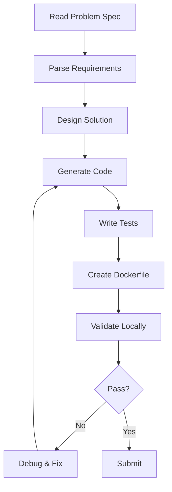

# Implementation Guide for AI Systems
# AI システム向け実装ガイド

## Overview / 概要

This guide provides step-by-step instructions for AI systems to successfully implement solutions for Req2Run benchmark problems.  
本ガイドは、AIシステムがReq2Runベンチマーク問題の解決策を正常に実装するための段階的な手順を提供します。

## Implementation Workflow / 実装ワークフロー



## Step-by-Step Process / 段階的プロセス

### Step 1: Problem Analysis / 問題分析

```python
def analyze_problem(problem_yaml):
    """Extract and prioritize requirements from problem specification."""
    
    requirements = {
        "must": [],    # Mandatory - 100% must be implemented
        "should": [],  # Recommended - Implement if possible
        "may": []      # Optional - Nice to have
    }
    
    # Parse RFC 2119 keywords
    for req in problem_yaml["requirements"]["functional"]:
        priority = req["priority"]
        requirements[priority.lower()].append(req)
    
    # Identify technical constraints
    constraints = {
        "language": problem_yaml["languages"],
        "packages": problem_yaml["constraints"]["allowed_packages"],
        "limits": problem_yaml["constraints"]["resource_limits"]
    }
    
    return requirements, constraints
```

### Step 2: Solution Architecture / ソリューション設計

#### 2.1 Component Design

```yaml
# Example architecture for WEB-001
architecture:
  layers:
    - name: API Layer
      components:
        - FastAPI application
        - JWT authentication middleware
        - Rate limiting middleware
    
    - name: Business Logic
      components:
        - Todo service
        - User service
        - Validation logic
    
    - name: Data Layer
      components:
        - SQLAlchemy ORM
        - Database models
        - Migration scripts
```

#### 2.2 File Structure Planning

```
solution/
├── src/
│   ├── __init__.py
│   ├── main.py           # Entry point
│   ├── api/              # API endpoints
│   │   ├── __init__.py
│   │   ├── auth.py       # Authentication
│   │   └── todos.py      # Todo operations
│   ├── models/           # Data models
│   │   ├── __init__.py
│   │   ├── user.py
│   │   └── todo.py
│   ├── services/         # Business logic
│   │   ├── __init__.py
│   │   └── todo_service.py
│   └── utils/            # Utilities
│       ├── __init__.py
│       ├── security.py
│       └── database.py
├── tests/
│   ├── unit/
│   ├── integration/
│   └── conftest.py
├── Dockerfile
├── requirements.txt
└── .env.example
```

### Step 3: Code Generation / コード生成

#### 3.1 Core Implementation Pattern

```python
# Template for implementing a requirement
class RequirementImplementation:
    """Base class for implementing requirements."""
    
    def __init__(self, requirement: dict):
        self.requirement = requirement
        self.priority = requirement["priority"]
        
    def implement(self) -> str:
        """Generate code for this requirement."""
        if self.priority == "MUST":
            return self._implement_mandatory()
        elif self.priority == "SHOULD":
            return self._implement_recommended()
        else:
            return self._implement_optional()
    
    def _implement_mandatory(self) -> str:
        """MUST requirements need complete implementation."""
        # Full implementation with error handling
        pass
    
    def _implement_recommended(self) -> str:
        """SHOULD requirements need best effort."""
        # Implementation with fallback options
        pass
    
    def _implement_optional(self) -> str:
        """MAY requirements are nice-to-have."""
        # Basic implementation or stub
        pass
```

#### 3.2 Error Handling Strategy

```python
# Robust error handling for production readiness
from typing import Optional, Union
from fastapi import HTTPException, status

class ErrorHandler:
    """Centralized error handling."""
    
    @staticmethod
    def handle_validation_error(error: Exception) -> HTTPException:
        """Convert validation errors to HTTP responses."""
        return HTTPException(
            status_code=status.HTTP_400_BAD_REQUEST,
            detail=str(error)
        )
    
    @staticmethod
    def handle_auth_error(error: Exception) -> HTTPException:
        """Handle authentication failures."""
        return HTTPException(
            status_code=status.HTTP_401_UNAUTHORIZED,
            detail="Authentication failed",
            headers={"WWW-Authenticate": "Bearer"}
        )
    
    @staticmethod
    def handle_database_error(error: Exception) -> HTTPException:
        """Handle database errors gracefully."""
        # Log the actual error
        logger.error(f"Database error: {error}")
        # Return generic message to client
        return HTTPException(
            status_code=status.HTTP_503_SERVICE_UNAVAILABLE,
            detail="Service temporarily unavailable"
        )
```

### Step 4: Test Implementation / テスト実装

#### 4.1 Test Coverage Strategy

```python
# Comprehensive test coverage
import pytest
from hypothesis import given, strategies as st

class TestStrategy:
    """Test implementation strategy."""
    
    def generate_unit_tests(self, function):
        """Generate unit tests for a function."""
        tests = []
        
        # Happy path
        tests.append(self._test_normal_input(function))
        
        # Edge cases
        tests.append(self._test_boundary_values(function))
        
        # Error cases
        tests.append(self._test_invalid_input(function))
        
        # Property-based tests
        tests.append(self._test_properties(function))
        
        return tests
    
    @given(st.text(min_size=1, max_size=100))
    def _test_properties(self, function, input_data):
        """Property-based testing."""
        result = function(input_data)
        # Assert invariants
        assert result is not None
        assert isinstance(result, expected_type)
```

#### 4.2 Integration Test Pattern

```python
# Integration test template
class IntegrationTestTemplate:
    """Template for integration tests."""
    
    @pytest.fixture
    async def client(self):
        """Create test client."""
        from httpx import AsyncClient
        from main import app
        
        async with AsyncClient(app=app, base_url="http://test") as client:
            yield client
    
    async def test_full_flow(self, client):
        """Test complete user flow."""
        # 1. Register user
        register_response = await client.post("/auth/register", json={
            "username": "testuser",
            "email": "test@example.com",
            "password": "SecurePass123!"
        })
        assert register_response.status_code == 201
        
        # 2. Login
        login_response = await client.post("/auth/login", data={
            "username": "testuser",
            "password": "SecurePass123!"
        })
        assert login_response.status_code == 200
        token = login_response.json()["access_token"]
        
        # 3. Create todo
        headers = {"Authorization": f"Bearer {token}"}
        todo_response = await client.post("/todos", 
            json={"title": "Test", "description": "Test todo"},
            headers=headers
        )
        assert todo_response.status_code == 201
```

### Step 5: Containerization / コンテナ化

#### 5.1 Optimized Dockerfile

```dockerfile
# Multi-stage build for minimal image size
FROM python:3.11-slim AS builder

# Install build dependencies
RUN apt-get update && apt-get install -y \
    gcc \
    && rm -rf /var/lib/apt/lists/*

# Create wheels
WORKDIR /app
COPY requirements.txt .
RUN pip wheel --no-cache-dir --no-deps --wheel-dir /wheels -r requirements.txt

# Final stage
FROM python:3.11-slim

# Security: Run as non-root user
RUN useradd -m -u 1000 appuser

# Install runtime dependencies
WORKDIR /app
COPY --from=builder /wheels /wheels
RUN pip install --no-cache /wheels/* && rm -rf /wheels

# Copy application
COPY --chown=appuser:appuser . .

# Security: Set proper permissions
RUN chmod -R 755 /app

USER appuser

# Health check
HEALTHCHECK --interval=30s --timeout=3s --start-period=5s --retries=3 \
    CMD python -c "import requests; requests.get('http://localhost:8000/health')"

# Run application
CMD ["uvicorn", "main:app", "--host", "0.0.0.0", "--port", "8000"]
```

### Step 6: Performance Optimization / パフォーマンス最適化

#### 6.1 Caching Strategy

```python
from functools import lru_cache
from typing import Optional
import redis
import json

class CacheManager:
    """Manage caching for performance."""
    
    def __init__(self):
        self.redis_client = redis.Redis(
            host='localhost',
            port=6379,
            decode_responses=True
        )
    
    def cache_result(self, key: str, value: any, ttl: int = 300):
        """Cache a result with TTL."""
        self.redis_client.setex(
            key,
            ttl,
            json.dumps(value)
        )
    
    def get_cached(self, key: str) -> Optional[any]:
        """Retrieve cached result."""
        result = self.redis_client.get(key)
        return json.loads(result) if result else None
    
    @lru_cache(maxsize=128)
    def expensive_computation(self, input_data):
        """Cache expensive computations in memory."""
        # Expensive operation
        result = perform_computation(input_data)
        return result
```

#### 6.2 Database Query Optimization

```python
from sqlalchemy import select, and_
from sqlalchemy.orm import selectinload

class OptimizedQueries:
    """Optimized database queries."""
    
    async def get_todos_with_pagination(
        self,
        user_id: int,
        page: int = 1,
        page_size: int = 10
    ):
        """Efficient pagination with eager loading."""
        # Use selectinload for N+1 query prevention
        stmt = (
            select(Todo)
            .where(Todo.user_id == user_id)
            .options(selectinload(Todo.tags))
            .offset((page - 1) * page_size)
            .limit(page_size)
        )
        
        # Execute with async session
        async with self.async_session() as session:
            result = await session.execute(stmt)
            todos = result.scalars().all()
            
        # Get total count with separate optimized query
        count_stmt = select(func.count()).where(Todo.user_id == user_id)
        total = await session.scalar(count_stmt)
        
        return todos, total
```

### Step 7: Security Implementation / セキュリティ実装

#### 7.1 Input Validation

```python
from pydantic import BaseModel, validator, Field
from typing import Optional
import re

class SecureInput(BaseModel):
    """Secure input validation."""
    
    username: str = Field(..., min_length=3, max_length=50)
    email: str = Field(..., regex=r'^[\w\.-]+@[\w\.-]+\.\w+$')
    password: str = Field(..., min_length=8, max_length=128)
    
    @validator('username')
    def validate_username(cls, v):
        """Prevent injection attacks."""
        if not re.match(r'^[a-zA-Z0-9_-]+$', v):
            raise ValueError('Username contains invalid characters')
        return v
    
    @validator('password')
    def validate_password(cls, v):
        """Enforce password complexity."""
        if not re.search(r'[A-Z]', v):
            raise ValueError('Password must contain uppercase')
        if not re.search(r'[a-z]', v):
            raise ValueError('Password must contain lowercase')
        if not re.search(r'\d', v):
            raise ValueError('Password must contain digit')
        if not re.search(r'[!@#$%^&*(),.?":{}|<>]', v):
            raise ValueError('Password must contain special character')
        return v
```

#### 7.2 Rate Limiting

```python
from collections import defaultdict
from time import time
import asyncio

class RateLimiter:
    """Token bucket rate limiter."""
    
    def __init__(self, rate: int = 100, period: int = 60):
        self.rate = rate  # Requests per period
        self.period = period  # Period in seconds
        self.buckets = defaultdict(lambda: {"tokens": rate, "last_update": time()})
    
    async def check_rate_limit(self, client_id: str) -> bool:
        """Check if request is within rate limit."""
        current_time = time()
        bucket = self.buckets[client_id]
        
        # Refill tokens based on time elapsed
        time_elapsed = current_time - bucket["last_update"]
        tokens_to_add = (time_elapsed / self.period) * self.rate
        
        bucket["tokens"] = min(
            self.rate,
            bucket["tokens"] + tokens_to_add
        )
        bucket["last_update"] = current_time
        
        # Check if token available
        if bucket["tokens"] >= 1:
            bucket["tokens"] -= 1
            return True
        
        return False
```

## Validation Checklist / 検証チェックリスト

Before submission, ensure:

- [ ] All MUST requirements are implemented
- [ ] All tests pass (unit, integration, property)
- [ ] Docker container builds successfully
- [ ] Health check endpoint responds
- [ ] Performance metrics meet thresholds
- [ ] Security scan shows no high vulnerabilities
- [ ] Code is formatted and linted
- [ ] Documentation is complete
- [ ] Environment variables are documented
- [ ] Secrets are not hardcoded

## Common Pitfalls / よくある落とし穴

### 1. Missing Error Handling
❌ **Wrong:**
```python
def get_user(user_id):
    return db.query(User).filter(User.id == user_id).first()
```

✅ **Correct:**
```python
def get_user(user_id):
    try:
        user = db.query(User).filter(User.id == user_id).first()
        if not user:
            raise HTTPException(404, "User not found")
        return user
    except SQLAlchemyError as e:
        logger.error(f"Database error: {e}")
        raise HTTPException(503, "Service unavailable")
```

### 2. Inefficient Database Queries
❌ **Wrong:**
```python
todos = []
for user in users:
    todos.extend(get_todos_for_user(user.id))  # N+1 query problem
```

✅ **Correct:**
```python
todos = db.query(Todo).join(User).filter(User.id.in_(user_ids)).all()
```

### 3. Security Vulnerabilities
❌ **Wrong:**
```python
query = f"SELECT * FROM users WHERE name = '{username}'"  # SQL injection
```

✅ **Correct:**
```python
query = select(User).where(User.name == username)  # Parameterized query
```

## Resources / リソース

- [FastAPI Best Practices](https://fastapi.tiangolo.com/tutorial/)
- [Docker Security Best Practices](https://docs.docker.com/develop/security-best-practices/)
- [OWASP Top 10](https://owasp.org/www-project-top-ten/)
- [Python Testing Best Practices](https://docs.pytest.org/en/stable/goodpractices.html)