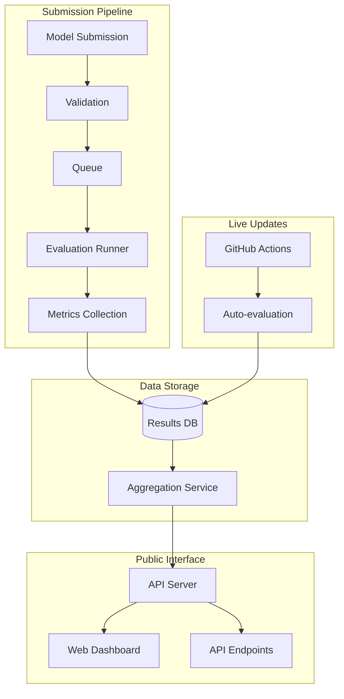

# Req2Run Leaderboard Design
# Req2Run リーダーボード設計

## Overview / 概要

Design specification for the public leaderboard system to track and compare AI model performance on the Req2Run benchmark.  
Req2Runベンチマークにおける AIモデルのパフォーマンスを追跡・比較するための公開リーダーボードシステムの設計仕様。

## Architecture / アーキテクチャ



## Leaderboard Categories / リーダーボードカテゴリ

### 1. Overall Leaderboard

Comprehensive ranking across all problems and metrics.

| Rank | Model | Organization | Total Score | Functional | Performance | Quality | Security | Cost/Score | Date |
|------|-------|--------------|-------------|------------|-------------|---------|----------|------------|------|
| 1 | GPT-4-Turbo | OpenAI | 92.3% | 95.0% | 88.5% | 91.2% | 94.1% | $0.52 | 2024-01-15 |
| 2 | Claude-3-Opus | Anthropic | 91.8% | 94.5% | 87.3% | 92.1% | 93.2% | $0.48 | 2024-01-14 |
| 3 | Gemini-Ultra | Google | 90.5% | 93.2% | 86.1% | 90.8% | 91.9% | $0.55 | 2024-01-13 |

### 2. Category-Specific Leaderboards

#### Web API Development
| Rank | Model | WEB-001 | WEB-002 | WEB-003 | Average |
|------|-------|---------|---------|---------|---------|
| 1 | Model A | 95.2% | 93.8% | 94.5% | 94.5% |

#### System Programming
| Rank | Model | SYS-001 | SYS-002 | SYS-003 | Average |
|------|-------|---------|---------|---------|---------|
| 1 | Model B | 88.3% | 91.2% | 89.7% | 89.7% |

### 3. Efficiency Leaderboard

Ranking by cost-effectiveness and resource usage.

| Rank | Model | Score/Dollar | Score/Token | Score/Second | Avg Efficiency |
|------|-------|--------------|-------------|--------------|----------------|
| 1 | Efficient-7B | 185.2 | 0.0023 | 2.45 | 100% |
| 2 | Fast-13B | 172.3 | 0.0021 | 2.89 | 95.3% |

### 4. Language-Specific Leaderboards

Performance per programming language.

| Rank | Model | Python | JavaScript | Go | Java | Rust | Average |
|------|-------|--------|------------|-----|------|------|---------|
| 1 | Polyglot-Pro | 93.2% | 91.8% | 89.5% | 88.7% | 87.3% | 90.1% |

## Submission Format / 提出形式

### Metadata Schema

```json
{
  "submission_id": "uuid-v4",
  "timestamp": "2024-01-15T10:30:00Z",
  "model": {
    "name": "GPT-4-Turbo",
    "version": "2024-01-01",
    "organization": "OpenAI",
    "parameters": "1.76T",
    "type": "autoregressive",
    "training_data_cutoff": "2023-12-01"
  },
  "configuration": {
    "temperature": 0.7,
    "max_tokens": 4096,
    "top_p": 0.95,
    "frequency_penalty": 0,
    "presence_penalty": 0,
    "system_prompt": "You are an expert programmer...",
    "tools_used": ["web_search", "code_execution"]
  },
  "hardware": {
    "gpu": "NVIDIA A100",
    "cpu": "AMD EPYC 7763",
    "memory": "512GB",
    "provider": "AWS"
  },
  "reproducibility": {
    "seed": 42,
    "deterministic": true,
    "docker_image": "req2run/evaluator:1.0.0",
    "commit_hash": "abc123def456"
  }
}
```

### Results Schema

```json
{
  "evaluation_id": "eval-uuid-v4",
  "submission_id": "uuid-v4",
  "problem_results": [
    {
      "problem_id": "WEB-001",
      "scores": {
        "total": 87.5,
        "functional_coverage": 95.0,
        "test_pass_rate": 88.0,
        "performance": 82.3,
        "code_quality": 85.7,
        "security": 86.5
      },
      "metrics": {
        "generation_time": 45.3,
        "tokens_used": 3421,
        "cost_usd": 0.103,
        "attempts": 1
      },
      "artifacts": {
        "code": "s3://bucket/submissions/uuid/code.tar.gz",
        "logs": "s3://bucket/submissions/uuid/logs.json",
        "report": "s3://bucket/submissions/uuid/report.html"
      }
    }
  ],
  "aggregate_scores": {
    "overall": 89.3,
    "by_category": {
      "web_api": 92.1,
      "cli_tool": 88.5,
      "system": 86.9
    },
    "by_difficulty": {
      "basic": 95.2,
      "intermediate": 90.3,
      "advanced": 85.1,
      "expert": 82.7
    }
  }
}
```

## Live Update System / ライブ更新システム

### Continuous Evaluation Pipeline

```yaml
name: Continuous Evaluation
on:
  schedule:
    - cron: '0 0 * * *'  # Daily at midnight
  workflow_dispatch:
  
jobs:
  evaluate-models:
    strategy:
      matrix:
        model: [gpt-4, claude-3, gemini, llama-3]
    steps:
      - name: Setup environment
        uses: actions/setup-python@v4
        
      - name: Run evaluation
        run: |
          python -m req2run evaluate \
            --model ${{ matrix.model }} \
            --problems all \
            --output results/
            
      - name: Upload results
        run: |
          python -m req2run upload \
            --results results/ \
            --leaderboard-api ${{ secrets.API_ENDPOINT }}
```

### Contamination Prevention

To prevent data contamination and gaming:

1. **Hidden Test Set**: 20% of test cases are private and rotated monthly
2. **Dynamic Problems**: New problems added quarterly
3. **Version Tracking**: Track which model versions have seen which problems
4. **Submission Limits**: Max 1 submission per model per day
5. **Code Review**: Random manual audits of suspicious submissions

## API Specification / API仕様

### Public Endpoints

```python
# FastAPI implementation
from fastapi import FastAPI, Query
from typing import Optional, List

app = FastAPI()

@app.get("/leaderboard")
async def get_leaderboard(
    category: Optional[str] = None,
    language: Optional[str] = None,
    date_from: Optional[str] = None,
    date_to: Optional[str] = None,
    limit: int = Query(default=100, le=1000)
) -> List[LeaderboardEntry]:
    """Get leaderboard entries with optional filters."""
    pass

@app.get("/submissions/{submission_id}")
async def get_submission(submission_id: str) -> SubmissionDetail:
    """Get detailed results for a specific submission."""
    pass

@app.get("/models/{model_name}/history")
async def get_model_history(
    model_name: str,
    problem_id: Optional[str] = None
) -> List[HistoricalResult]:
    """Get historical performance for a model."""
    pass

@app.get("/problems/{problem_id}/rankings")
async def get_problem_rankings(problem_id: str) -> List[ProblemRanking]:
    """Get rankings for a specific problem."""
    pass

@app.post("/submit")
async def submit_evaluation(
    submission: SubmissionRequest,
    api_key: str = Header()
) -> SubmissionResponse:
    """Submit new evaluation results (requires authentication)."""
    pass
```

## Web Dashboard / ウェブダッシュボード

### Features

1. **Interactive Charts**
   - Score trends over time
   - Performance comparison radar charts
   - Cost-efficiency scatter plots

2. **Filtering and Search**
   - Filter by date range, category, language
   - Search by model name or organization
   - Custom metric combinations

3. **Detailed Views**
   - Individual submission details
   - Code artifacts viewing
   - Error analysis and logs

4. **Export Functions**
   - CSV/JSON data export
   - Chart image export
   - LaTeX table generation

### UI Mockup

```
┌─────────────────────────────────────────────────────────────┐
│ Req2Run Leaderboard                              [Search] 🔍│
├─────────────────────────────────────────────────────────────┤
│ Filters: [All Categories ▼] [All Languages ▼] [Last 30d ▼] │
├─────────────────────────────────────────────────────────────┤
│ ┌──────────────────────────┐ ┌────────────────────────────┐│
│ │ Overall Rankings         │ │ Score Distribution         ││
│ │ 1. GPT-4-T    92.3% 🥇  │ │ ████████████ GPT-4-T      ││
│ │ 2. Claude-3   91.8% 🥈  │ │ ███████████  Claude-3     ││
│ │ 3. Gemini-U   90.5% 🥉  │ │ ██████████   Gemini-U     ││
│ └──────────────────────────┘ └────────────────────────────┘│
│ ┌───────────────────────────────────────────────────────────┐
│ │ Trends (Last 30 Days)                                     │
│ │     ↗️ GPT-4-Turbo      +2.3%                            │
│ │     ↗️ Claude-3-Opus    +1.8%                            │
│ │     ↘️ Gemini-Ultra     -0.5%                            │
│ └───────────────────────────────────────────────────────────┘
└─────────────────────────────────────────────────────────────┘
```

## Data Integrity / データ整合性

### Verification System

```python
class ResultVerifier:
    """Verifies evaluation results integrity."""
    
    def verify_submission(self, submission: dict) -> bool:
        """Verify a submission's authenticity."""
        checks = [
            self._verify_signature(submission),
            self._verify_timestamps(submission),
            self._verify_metrics_consistency(submission),
            self._verify_artifact_hashes(submission),
            self._check_anomalies(submission)
        ]
        return all(checks)
    
    def _verify_signature(self, submission: dict) -> bool:
        """Verify cryptographic signature."""
        signature = submission.get("signature")
        public_key = self.get_public_key(submission["model"]["organization"])
        return crypto.verify(submission["data"], signature, public_key)
    
    def _check_anomalies(self, submission: dict) -> bool:
        """Check for statistical anomalies."""
        # Detect impossible scores, time travel, etc.
        pass
```

## Privacy and Ethics / プライバシーと倫理

### Guidelines

1. **No Personal Data**: Submissions must not contain PII
2. **Code Attribution**: Respect licenses and attribution
3. **Fair Competition**: No coordinated manipulation
4. **Transparency**: Evaluation methodology is public
5. **Appeals Process**: Formal process for score disputes

### Data Retention

- Submissions: Retained for 1 year
- Aggregated scores: Retained indefinitely
- Logs: Retained for 90 days
- Artifacts: Retained for 30 days (optional permanent storage)

## Implementation Roadmap / 実装ロードマップ

### Phase 1: MVP (Q1 2024)
- [ ] Basic API endpoints
- [ ] Simple web dashboard
- [ ] Manual submission process
- [ ] SQLite database

### Phase 2: Automation (Q2 2024)
- [ ] GitHub Actions integration
- [ ] Automated evaluation pipeline
- [ ] PostgreSQL migration
- [ ] Real-time updates

### Phase 3: Scale (Q3 2024)
- [ ] Distributed evaluation
- [ ] CDN for artifacts
- [ ] Advanced analytics
- [ ] Mobile app

### Phase 4: Community (Q4 2024)
- [ ] User accounts
- [ ] Custom leaderboards
- [ ] Badges and achievements
- [ ] Discussion forums

## References / 参考資料

- [HuggingFace Open LLM Leaderboard](https://huggingface.co/spaces/HuggingFaceH4/open_llm_leaderboard)
- [SWE-bench Leaderboard](https://www.swebench.com/)
- [EvalPlus Leaderboard](https://evalplus.github.io/leaderboard.html)
- [Papers with Code](https://paperswithcode.com/)