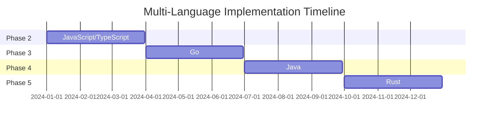

# Multi-Language Support Roadmap
# 多言語サポートロードマップ

## Overview / 概要

This document outlines the roadmap for supporting multiple programming languages in the Req2Run benchmark framework.  
本ドキュメントは、Req2Runベンチマークフレームワークにおける多言語サポートのロードマップを示します。

## Current Status / 現状

### Phase 1: Python (Completed ✅)
- **Status**: Primary implementation language
- **Coverage**: All problem categories
- **Tooling**: Complete evaluation pipeline
- **Baselines**: WEB-001, CLI-001 implemented

## Implementation Phases / 実装フェーズ

### Phase 2: JavaScript/TypeScript (Q1 2024)

**Target Problems**: WEB-001, CLI-001, DATA-001

**Implementation Plan**:
```javascript
// Package structure
{
  "runtime": "node:20-alpine",
  "frameworks": {
    "web": ["express", "fastify", "nestjs"],
    "cli": ["commander", "yargs", "oclif"],
    "test": ["jest", "mocha", "vitest"]
  },
  "tools": {
    "linter": "eslint",
    "formatter": "prettier",
    "bundler": "esbuild",
    "type_checker": "typescript"
  }
}
```

**Evaluation Adaptations**:
- Modify runner.py to support npm/yarn commands
- Add Node.js-specific performance metrics
- Integrate ESLint for code quality scoring

### Phase 3: Go (Q2 2024)

**Target Problems**: NET-001, SYS-001, CRYPTO-001

**Implementation Plan**:
```go
// Module structure
module github.com/req2run/baseline

require (
    "runtime": "golang:1.21-alpine",
    "frameworks": {
        "web": ["gin", "echo", "fiber"],
        "cli": ["cobra", "urfave/cli"],
        "test": ["testing", "testify", "ginkgo"]
    },
    "tools": {
        "linter": "golangci-lint",
        "formatter": "gofmt",
        "security": "gosec"
    }
)
```

**Evaluation Adaptations**:
- Add Go module dependency resolution
- Implement Go-specific build optimizations
- Support both CGO enabled/disabled modes

### Phase 4: Java (Q3 2024)

**Target Problems**: WEB-001, DATA-002, STREAM-001

**Implementation Plan**:
```xml
<!-- Build configuration -->
<project>
  <runtime>eclipse-temurin:17-jre</runtime>
  <frameworks>
    <web>Spring Boot, Quarkus, Micronaut</web>
    <cli>Picocli, JCommander</cli>
    <test>JUnit 5, TestNG, Spock</test>
  </frameworks>
  <tools>
    <build>Maven, Gradle</build>
    <linter>Checkstyle, SpotBugs</linter>
    <security>OWASP Dependency Check</security>
  </tools>
</project>
```

**Evaluation Adaptations**:
- Support both Maven and Gradle build systems
- Add JVM-specific metrics (heap, GC)
- Implement JAR packaging and deployment

### Phase 5: Rust (Q4 2024)

**Target Problems**: SYS-002, CRYPTO-002, NET-002

**Implementation Plan**:
```toml
# Cargo.toml structure
[package]
runtime = "rust:1.75-slim"

[frameworks]
web = ["actix-web", "rocket", "axum"]
cli = ["clap", "structopt"]
test = ["cargo test", "criterion"]

[tools]
linter = "clippy"
formatter = "rustfmt"
security = "cargo-audit"
```

**Evaluation Adaptations**:
- Integrate Cargo for dependency management
- Add memory safety validation
- Support both debug and release builds

## Cross-Language Considerations / 言語横断的な考慮事項

### 1. Problem Specification Translation

Each problem must be translatable across languages while maintaining:
- Functional requirements consistency
- Performance baselines adjusted per language
- Idiomatic code patterns

**Example Translation Matrix**:

| Requirement | Python | JavaScript | Go | Java | Rust |
|-------------|--------|------------|-----|------|------|
| Async I/O | asyncio | async/await | goroutines | CompletableFuture | tokio |
| HTTP Server | FastAPI | Express | Gin | Spring | Actix |
| JSON Parse | json | JSON | encoding/json | Jackson | serde |

### 2. Evaluation Normalization

Different languages have different performance characteristics. Normalization factors:

```python
PERFORMANCE_WEIGHTS = {
    "python": 1.0,      # Baseline
    "javascript": 0.9,  # Slightly faster for I/O
    "go": 0.5,          # Much faster execution
    "java": 0.7,        # Faster but with startup overhead
    "rust": 0.4         # Fastest execution
}

def normalize_score(raw_score, language):
    return raw_score * PERFORMANCE_WEIGHTS[language]
```

### 3. Container Optimization

Language-specific container optimizations:

```dockerfile
# Python - Multi-stage build
FROM python:3.11-slim AS builder
COPY requirements.txt .
RUN pip wheel --no-cache-dir --no-deps --wheel-dir /wheels -r requirements.txt

FROM python:3.11-slim
COPY --from=builder /wheels /wheels
RUN pip install --no-cache /wheels/*

# Node.js - Production dependencies only
FROM node:20-alpine AS builder
COPY package*.json ./
RUN npm ci --only=production

FROM node:20-alpine
COPY --from=builder node_modules node_modules

# Go - Static binary
FROM golang:1.21-alpine AS builder
COPY . .
RUN CGO_ENABLED=0 go build -ldflags="-w -s" -o app

FROM scratch
COPY --from=builder /app /app

# Java - JRE only
FROM maven:3.9-eclipse-temurin-17 AS builder
COPY . .
RUN mvn clean package

FROM eclipse-temurin:17-jre-alpine
COPY --from=builder target/*.jar app.jar

# Rust - Minimal runtime
FROM rust:1.75 AS builder
COPY . .
RUN cargo build --release

FROM debian:bookworm-slim
COPY --from=builder target/release/app /app
```

## Testing Strategy / テスト戦略

### Language-Agnostic Test Suite

Core test scenarios that must pass regardless of implementation language:

1. **Functional Tests**: Same input → Same output
2. **Performance Tests**: Meet minimum thresholds
3. **Security Tests**: No vulnerabilities
4. **Integration Tests**: API compatibility

### Test Translation Framework

```python
class TestTranslator:
    """Translates test cases between languages."""
    
    def translate_test(self, test_case, from_lang, to_lang):
        """Convert test case from one language to another."""
        translators = {
            ("python", "javascript"): self._py_to_js,
            ("python", "go"): self._py_to_go,
            # ... more translators
        }
        
        translator = translators.get((from_lang, to_lang))
        if translator:
            return translator(test_case)
        raise NotImplementedError(f"No translator for {from_lang} → {to_lang}")
```

## Migration Guide / 移行ガイド

### For Problem Authors

When adding a new problem, provide:
1. Language-agnostic specification (YAML)
2. Reference implementation in Python
3. Test cases in JSON format
4. Performance baselines per language

### For Contributors

To add support for a new language:
1. Implement runner adapter in `req2run/runners/`
2. Create Dockerfile template
3. Add language-specific metrics collectors
4. Provide at least 3 baseline implementations
5. Document idiomatic patterns

## Success Metrics / 成功指標

### Phase Completion Criteria

Each language phase is considered complete when:
- [ ] Runner implementation complete
- [ ] 5+ problems have baseline implementations
- [ ] Documentation in native language
- [ ] CI/CD pipeline integrated
- [ ] Performance benchmarks established
- [ ] Community review passed

### Quality Gates

- Test coverage ≥ 80%
- Documentation coverage ≥ 90%
- Performance regression < 5%
- Security vulnerabilities = 0

## Timeline / タイムライン



## References / 参考資料

- [MultiPL-E](https://github.com/nuprl/MultiPL-E): Multi-language benchmark translation
- [The Computer Language Benchmarks Game](https://benchmarksgame-team.pages.debian.net/benchmarksgame/): Performance comparisons
- [Rosetta Code](https://rosettacode.org/): Problem solutions in multiple languages