# Universal Framework Adapter Interface (UFAI) Design Document
# ユニバーサルフレームワークアダプターインターフェース (UFAI) 設計書

## Executive Summary / エグゼクティブサマリ

The Universal Framework Adapter Interface (UFAI) is a standardized benchmarking framework that enables any web framework, API framework, or backend system to participate in the Req2Run benchmark through a simple, stable, and language-agnostic interface.

UFAIは、シンプルで安定した言語非依存のインターフェースを通じて、あらゆるWebフレームワーク、APIフレームワーク、バックエンドシステムがReq2Runベンチマークに参加できるようにする標準化されたベンチマークフレームワークです。

## Motivation / 動機

### Current Challenges (現在の課題)

1. **Framework Diversity**: Each framework has unique build systems, test runners, and deployment methods
2. **Language Barriers**: Different languages require different toolchains and environments
3. **Comparison Difficulty**: No standardized way to compare frameworks across languages
4. **Maintenance Burden**: Custom adapters for each framework are hard to maintain

### Solution (解決策)

UFAI provides:
- **Standardized Interface**: Common CLI commands across all frameworks
- **Language Agnostic**: Works with any programming language
- **Minimal Integration**: Frameworks only need to add a `bench.yaml` file
- **Automated Benchmarking**: Consistent evaluation across all participants

## Architecture / アーキテクチャ

```mermaid
graph TB
    subgraph "Framework Project / フレームワークプロジェクト"
        FW[Framework Code]
        BY[bench.yaml]
        BA[Bench Adapter]
    end
    
    subgraph "UFAI Layer / UFAI層"
        CLI[Bench CLI]
        VAL[Validator]
        EX[Executor]
    end
    
    subgraph "Evaluation Engine / 評価エンジン"
        BUILD[Build Stage]
        TEST[Test Stage]
        PERF[Performance Stage]
        SEC[Security Stage]
    end
    
    subgraph "Output / 出力"
        JSON[results.json]
        HTML[report.html]
        METRICS[metrics.json]
    end
    
    FW --> BY
    BY --> BA
    BA --> CLI
    CLI --> VAL
    VAL --> EX
    EX --> BUILD
    BUILD --> TEST
    TEST --> PERF
    PERF --> SEC
    SEC --> JSON
    JSON --> HTML
    JSON --> METRICS
```



## Core Components / コアコンポーネント

### 1. bench.yaml Configuration File

The `bench.yaml` file is the entry point for framework participation. It declares capabilities and provides metadata.

```yaml
# bench.yaml example
version: "1.0"
framework:
  name: "FastAPI"
  version: "0.100.0"
  language: "python"
  description: "Modern, fast web framework for building APIs"

compliance:
  level: "L3"  # L0-L5 compliance level
  features:
    - build
    - test
    - performance
    - security

commands:
  build:
    script: "pip install -r requirements.txt"
    timeout: 300
    
  test:
    script: "pytest tests/"
    timeout: 600
    coverage: true
    
  performance:
    script: "locust -f tests/perf/locustfile.py"
    endpoint: "http://localhost:8000"
    duration: 60
    
  security:
    script: "bandit -r src/"
    scan_type: "static"

environment:
  variables:
    PYTHONPATH: "./src"
    ENV: "test"
  
  ports:
    - 8000
    - 5432
  
  services:
    - postgres:15
    - redis:7

artifacts:
  coverage: "htmlcov/index.html"
  performance: "results/performance.json"
  security: "security-report.json"
```

### 2. Bench CLI Commands

Standardized commands that work across all frameworks:

```bash
# Core commands
bench init          # Initialize bench.yaml
bench validate      # Validate configuration
bench build         # Build the project
bench test          # Run tests
bench perf          # Run performance tests
bench security      # Run security scans
bench all           # Run all stages

# Utility commands
bench report        # Generate HTML report
bench export        # Export results.json
bench compare       # Compare with baseline
bench clean         # Clean artifacts
```

### 3. Results Schema (results.json)

Standardized output format for all benchmarks:

```json
{
  "version": "1.0",
  "timestamp": "2024-01-30T10:00:00Z",
  "framework": {
    "name": "FastAPI",
    "version": "0.100.0",
    "language": "python"
  },
  "compliance": {
    "level": "L3",
    "score": 85
  },
  "stages": {
    "build": {
      "status": "success",
      "duration": 45.2,
      "metrics": {
        "dependencies": 42,
        "size_mb": 125
      }
    },
    "test": {
      "status": "success",
      "duration": 120.5,
      "metrics": {
        "total": 250,
        "passed": 248,
        "failed": 2,
        "coverage": 92.5
      }
    },
    "performance": {
      "status": "success",
      "duration": 60.0,
      "metrics": {
        "requests_per_second": 5420,
        "latency_p50": 15,
        "latency_p95": 45,
        "latency_p99": 120,
        "error_rate": 0.01
      }
    },
    "security": {
      "status": "success",
      "duration": 30.0,
      "metrics": {
        "vulnerabilities": {
          "critical": 0,
          "high": 0,
          "medium": 2,
          "low": 5
        },
        "compliance_score": 88
      }
    }
  },
  "overall": {
    "score": 87.5,
    "grade": "B+",
    "badges": ["performance", "security", "tested"]
  }
}
```

## Compliance Levels / コンプライアンスレベル

### Level Definitions

| Level | Name | Requirements | Badge |
|-------|------|-------------|-------|
| **L0** | Basic | `bench.yaml` exists, build command works | 🔵 |
| **L1** | Testable | Tests run and pass (>80% pass rate) | 🟢 |
| **L2** | Measured | Performance metrics collected | 🟡 |
| **L3** | Secure | Security scanning implemented | 🟠 |
| **L4** | Observable | Logging, metrics, tracing | 🔴 |
| **L5** | Complete | All features, >90% scores | 🌟 |

### Progressive Enhancement

Frameworks can start at L0 and progressively add features:

```yaml
# L0: Minimal bench.yaml
version: "1.0"
framework:
  name: "MyFramework"
commands:
  build:
    script: "make build"

# L1: Add testing
commands:
  build:
    script: "make build"
  test:
    script: "make test"

# L2: Add performance
commands:
  # ... previous commands
  performance:
    script: "make bench"
    endpoint: "http://localhost:3000"

# Continue adding features...
```

## Docker Adapter / Dockerアダプター

### Universal Docker Image

A generic Docker image that can run any framework with bench.yaml:

```dockerfile
# adapters/universal/Dockerfile
FROM ubuntu:22.04

# Install common runtimes
RUN apt-get update && apt-get install -y \
    python3 python3-pip \
    nodejs npm \
    golang \
    openjdk-17-jdk \
    ruby \
    rust cargo \
    && rm -rf /var/lib/apt/lists/*

# Install bench CLI
COPY --from=builder /bench /usr/local/bin/bench

# Security tools
RUN pip3 install bandit safety && \
    npm install -g snyk && \
    go install github.com/securego/gosec/v2/cmd/gosec@latest

# Performance tools
RUN pip3 install locust && \
    npm install -g autocannon && \
    apt-get install -y wrk apache2-utils

WORKDIR /app

# Entry point
ENTRYPOINT ["bench"]
CMD ["all"]
```

### Usage Example

```bash
# Run any framework with bench.yaml
docker run -v $(pwd):/app ufai/bench:latest all

# Specific stage
docker run -v $(pwd):/app ufai/bench:latest test

# With custom config
docker run -v $(pwd):/app -e BENCH_CONFIG=custom.yaml ufai/bench:latest all
```

## Integration Guide / 統合ガイド

### For Framework Authors

1. **Create bench.yaml**
   ```bash
   bench init
   # Follow interactive prompts
   ```

2. **Validate Configuration**
   ```bash
   bench validate
   ```

3. **Test Locally**
   ```bash
   bench all --local
   ```

4. **Submit to Registry**
   ```bash
   bench submit --registry https://bench.req2run.io
   ```

### For Benchmark Operators

1. **Clone Framework**
   ```bash
   git clone <framework-repo>
   ```

2. **Run Benchmark**
   ```bash
   bench all --sandbox
   ```

3. **Generate Report**
   ```bash
   bench report --format html
   ```

4. **Publish Results**
   ```bash
   bench publish --leaderboard
   ```

## Security Considerations / セキュリティ考慮事項

### Sandboxing

- All benchmarks run in isolated containers
- Network egress is denied by default
- Resource limits enforced (CPU, memory, disk)
- Time limits prevent infinite loops

### Validation

- bench.yaml schema validation
- Command injection prevention
- Path traversal protection
- Dependency scanning

## Roadmap / ロードマップ

### Phase 1: Foundation (Q1 2024)
- [ ] Define bench.yaml schema
- [ ] Implement core CLI commands
- [ ] Create Docker adapter
- [ ] Basic validation and execution

### Phase 2: Integration (Q2 2024)
- [ ] Add 10+ framework examples
- [ ] Registry service
- [ ] Automated CI/CD
- [ ] Web dashboard

### Phase 3: Expansion (Q3 2024)
- [ ] Multi-language SDKs
- [ ] Cloud runner service
- [ ] Historical tracking
- [ ] Comparative analysis

### Phase 4: Ecosystem (Q4 2024)
- [ ] Community contributions
- [ ] Plugin system
- [ ] Custom metrics
- [ ] Enterprise features

## Benefits / メリット

### For Framework Authors
- ✅ Simple integration (just add bench.yaml)
- ✅ Free benchmarking infrastructure
- ✅ Visibility and recognition
- ✅ Continuous performance tracking

### For Users
- ✅ Objective framework comparison
- ✅ Standardized metrics
- ✅ Security confidence
- ✅ Performance guarantees

### For the Ecosystem
- ✅ Drives quality improvements
- ✅ Encourages best practices
- ✅ Facilitates innovation
- ✅ Creates healthy competition

## Example Implementations / 実装例

### Python/FastAPI
```yaml
version: "1.0"
framework:
  name: "FastAPI"
  language: "python"
compliance:
  level: "L4"
commands:
  build: "pip install -e ."
  test: "pytest --cov"
  performance: "locust -f tests/perf.py"
  security: "bandit -r app/"
```

### Node.js/Express
```yaml
version: "1.0"
framework:
  name: "Express"
  language: "javascript"
compliance:
  level: "L3"
commands:
  build: "npm install"
  test: "npm test"
  performance: "autocannon http://localhost:3000"
  security: "npm audit"
```

### Go/Gin
```yaml
version: "1.0"
framework:
  name: "Gin"
  language: "go"
compliance:
  level: "L4"
commands:
  build: "go build ./..."
  test: "go test -cover ./..."
  performance: "go test -bench=."
  security: "gosec ./..."
```

## Conclusion / まとめ

UFAI provides a universal, standardized way for any framework to participate in benchmarking. By defining a simple interface and progressive compliance levels, we enable fair comparison across languages and paradigms while minimizing integration effort.

UFAIは、あらゆるフレームワークがベンチマークに参加できるユニバーサルで標準化された方法を提供します。シンプルなインターフェースと段階的なコンプライアンスレベルを定義することで、統合の手間を最小限に抑えながら、言語やパラダイムを超えた公平な比較を可能にします。