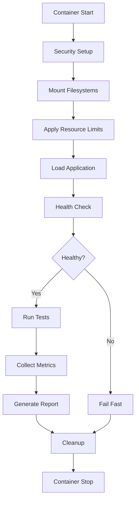

# Runtime Environment Specification
# ランタイム環境仕様

## Overview / 概要

This document defines the standardized runtime environment for Req2Run benchmark execution.  
本ドキュメントは、Req2Runベンチマーク実行のための標準化されたランタイム環境を定義します。

## Container Configuration / コンテナ設定

### Base Images / ベースイメージ

| Language | Base Image | Version |
|----------|------------|---------|
| Python | python:3.11-slim | 3.11.x |
| Node.js | node:20-alpine | 20.x LTS |
| Go | golang:1.21-alpine | 1.21.x |
| Java | eclipse-temurin:17-jre | 17 LTS |
| Rust | rust:1.75-slim | 1.75.x |

### Resource Limits / リソース制限

```yaml
resources:
  limits:
    cpu: "2000m"  # 2 CPU cores
    memory: "512Mi"  # 512MB RAM
    ephemeral-storage: "1Gi"  # 1GB disk
  requests:
    cpu: "500m"  # 0.5 CPU cores
    memory: "256Mi"  # 256MB RAM
```

## Network Isolation / ネットワーク分離

### Default Policy: DENY ALL

By default, all network egress is **DENIED**. Submissions must not make external network calls.

```yaml
apiVersion: networking.k8s.io/v1
kind: NetworkPolicy
metadata:
  name: deny-egress
spec:
  podSelector: {}
  policyTypes:
  - Egress
  egress: []  # No egress allowed
```

### Exceptions

Only the following internal services are accessible:
- Database (PostgreSQL/MySQL/MongoDB) on designated ports
- Redis cache on port 6379
- Internal API endpoints for testing

## Security Sandboxing / セキュリティサンドボックス

### nsjail Configuration

```bash
nsjail \
  --mode ONCE \
  --max_cpus 2 \
  --time_limit 300 \
  --rlimit_as 512 \
  --rlimit_cpu 300 \
  --rlimit_fsize 104857600 \
  --rlimit_nofile 256 \
  --disable_clone_newnet \
  --disable_clone_newuser
```

### Seccomp Profile

```json
{
  "defaultAction": "SCMP_ACT_ERRNO",
  "architectures": ["SCMP_ARCH_X86_64"],
  "syscalls": [
    {
      "names": [
        "read", "write", "close", "fstat", "lseek",
        "mmap", "mprotect", "munmap", "brk",
        "rt_sigaction", "rt_sigprocmask", "rt_sigreturn",
        "ioctl", "nanosleep", "select", "poll",
        "dup", "dup2", "fcntl", "getpid", "getuid",
        "exit_group", "exit"
      ],
      "action": "SCMP_ACT_ALLOW"
    }
  ]
}
```

### Prohibited System Calls

The following system calls are **PROHIBITED** and will result in immediate termination:

- `mount`, `umount` - Filesystem mounting
- `setuid`, `setgid` - Privilege escalation
- `chroot` - Root directory changes
- `ptrace` - Process tracing
- `kexec_load` - Kernel execution
- `bpf` - BPF programs
- `clone` with `CLONE_NEWUSER` - User namespace creation

## Filesystem Layout / ファイルシステムレイアウト

```
/
├── app/                 # Application code (read-only)
│   ├── src/            # Source code
│   ├── tests/          # Test files
│   └── requirements.*  # Dependencies
├── data/               # Test data (read-only)
│   ├── input/         # Input fixtures
│   └── expected/      # Expected outputs
├── tmp/                # Temporary files (read-write)
│   └── workspace/     # Working directory
└── output/             # Results output (write-only)
    ├── logs/          # Execution logs
    ├── metrics/       # Performance metrics
    └── artifacts/     # Generated artifacts
```

### Permissions

- `/app`: Read-only (555)
- `/data`: Read-only (555)
- `/tmp`: Read-write (1777)
- `/output`: Write-only (333)

## Environment Variables / 環境変数

### Standard Variables

```bash
# Application settings
APP_ENV=production
LOG_LEVEL=info
MAX_WORKERS=4

# Resource limits
MEMORY_LIMIT=512M
CPU_LIMIT=2
TIMEOUT=300

# Security
DISABLE_NETWORK=true
ENABLE_SANDBOX=true
STRICT_MODE=true

# Paths
APP_ROOT=/app
DATA_DIR=/data
TEMP_DIR=/tmp
OUTPUT_DIR=/output
```

### Language-Specific Variables

#### Python
```bash
PYTHONPATH=/app
PYTHONDONTWRITEBYTECODE=1
PYTHONUNBUFFERED=1
PYTHONHASHSEED=42
```

#### Node.js
```bash
NODE_ENV=production
NODE_OPTIONS="--max-old-space-size=512"
NPM_CONFIG_LOGLEVEL=error
```

#### Go
```bash
GOPATH=/go
GOCACHE=/tmp/go-cache
GO111MODULE=on
CGO_ENABLED=0
```

## Monitoring and Logging / 監視とロギング

### Metrics Collection

The following metrics are automatically collected:

- CPU usage (user, system, idle)
- Memory usage (RSS, heap, stack)
- Disk I/O (read/write bytes)
- Network I/O (if permitted)
- System calls count
- Process count

### Log Aggregation

All logs are collected and stored in structured JSON format:

```json
{
  "timestamp": "2024-01-15T10:30:00.000Z",
  "level": "info",
  "component": "evaluator",
  "message": "Test execution started",
  "metadata": {
    "problem_id": "WEB-001",
    "submission_id": "abc123",
    "environment": "docker"
  }
}
```

## Execution Flow / 実行フロー



## Compliance Requirements / コンプライアンス要件

### Mandatory Requirements (MUST)

- Container MUST start within 30 seconds
- Application MUST respond to health checks within 5 seconds
- Memory usage MUST NOT exceed 512MB
- CPU usage MUST NOT exceed 2 cores
- No network egress MUST be attempted
- All file operations MUST be within designated paths

### Recommended Requirements (SHOULD)

- Container SHOULD use minimal base images
- Application SHOULD implement graceful shutdown
- Logs SHOULD be structured JSON
- Metrics SHOULD be exported in Prometheus format

## Troubleshooting / トラブルシューティング

### Common Issues

| Issue | Cause | Solution |
|-------|-------|----------|
| Container OOM | Memory limit exceeded | Optimize memory usage, reduce data size |
| Timeout | Execution time exceeded | Optimize algorithms, use caching |
| Permission denied | Invalid file access | Use designated directories only |
| Network unreachable | Egress blocked | Remove external dependencies |
| Syscall blocked | Prohibited operation | Review allowed syscall list |

### Debug Mode

For debugging, set `DEBUG=true` to enable:
- Verbose logging
- Extended timeout (600s)
- Core dumps
- Syscall tracing

## Version History / バージョン履歴

- **v1.0.0** (2024-01-15): Initial specification
- **v1.1.0** (2024-01-20): Added multi-language support
- **v1.2.0** (2024-01-25): Enhanced security policies