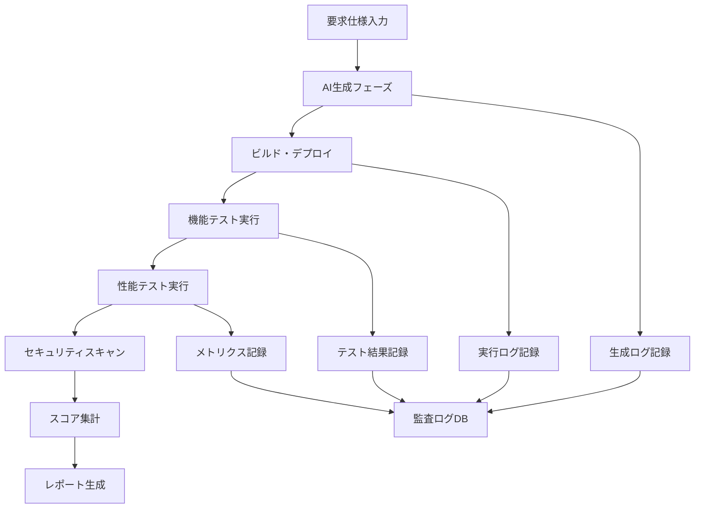

# Req2Run Evaluation Framework

## 1. 評価原則

### 1.1 基本原則

```yaml
principles:
  fairness: "全参加システムに同一条件を適用"
  reproducibility: "評価結果の再現可能性を保証"
  automation: "人間の判断を最小化した自動評価"
  transparency: "評価プロセスと結果の完全公開"
  security: "サンドボックス環境での安全な実行"
```

### 1.2 評価対象の定義

**純粋AI生成物**
- AIシステムが要求仕様から自動生成したコード・設定のみ評価
- テンプレート使用は許可するが、事前申告必須
- 外部ライブラリは標準的なもののみ使用可

**禁止事項**
- 評価中の人間による修正
- 問題固有のハードコーディング
- 外部APIへの処理委譲（評価対象機能について）

## 2. 実行環境標準化

### 2.1 統一実行環境

```yaml
execution_environment:
  infrastructure:
    provider: "AWS/GCP/Azure (統一)"
    instance_types:
      - compute: "8 vCPU, 32GB RAM"
      - memory: "4 vCPU, 64GB RAM"
      - gpu: "T4 GPU, 4 vCPU, 16GB RAM"
    
  container_runtime:
    platform: "Kubernetes v1.28"
    container_runtime: "containerd 1.7"
    resource_limits:
      cpu: "4000m"
      memory: "16Gi"
      ephemeral_storage: "100Gi"
    
  network:
    bandwidth: "10 Gbps"
    latency_simulation: "可変（1-100ms）"
    packet_loss: "設定可能（0-5%）"

  time_sync:
    ntp_server: "pool.ntp.org"
    timezone: "UTC"
```

### 2.2 言語・フレームワーク標準

```yaml
supported_stacks:
  languages:
    - python: "3.11"
    - nodejs: "20 LTS"
    - go: "1.21"
    - java: "17 LTS"
    - rust: "1.75"
  
  databases:
    - postgresql: "15"
    - mysql: "8.0"
    - mongodb: "7.0"
    - redis: "7.2"
  
  infrastructure_tools:
    - docker: "24.0"
    - terraform: "1.6"
    - helm: "3.13"
```

## 3. 制約条件

### 3.1 時間制約

```yaml
time_limits:
  generation_phase:
    simple_problem: "5 minutes"
    intermediate_problem: "15 minutes"
    advanced_problem: "30 minutes"
    expert_problem: "60 minutes"
  
  execution_phase:
    build_and_deploy: "10 minutes"
    test_execution: "30 minutes"
    performance_test: "60 minutes"
  
  total_timeout:
    max_duration: "3 hours per problem"
    
  retry_policy:
    max_retries: 0  # 再試行禁止
    exception: "インフラ障害時のみ1回再実行"
```

### 3.2 リソース制約

```yaml
resource_limits:
  generation:
    api_calls: "無制限（ただし記録）"
    token_usage: "記録して公開"
    
  execution:
    cpu_quota: "4000 CPU seconds"
    memory_peak: "16GB"
    disk_io: "1GB/s"
    network_io: "100MB/s"
    
  storage:
    build_artifacts: "10GB"
    runtime_data: "50GB"
    logs: "5GB"
```

### 3.3 人間介入の扱い

```yaml
human_intervention:
  prohibited:
    - "生成コードの手動修正"
    - "デバッグ中の手動介入"
    - "テスト実行中の調整"
  
  allowed:
    - "初期プロンプトの作成"
    - "実行開始トリガー"
    - "結果の確認（読み取りのみ）"
  
  monitoring:
    - "全入力の記録"
    - "タイムスタンプ付きログ"
    - "ビデオ録画（オプション）"
```

## 4. 評価メトリクス

### 4.1 機能評価

```yaml
functional_metrics:
  requirement_coverage:
    calculation: "実装済み要件数 / 全要件数"
    weight: 0.3
    measurement:
      - "自動テストによる検証"
      - "API呼び出しによる確認"
      - "ログ解析による判定"
  
  test_pass_rate:
    calculation: "成功テストケース数 / 全テストケース数"
    weight: 0.3
    measurement:
      - "提供テストスイート実行"
      - "エッジケーステスト"
      - "負荷テスト"
  
  correctness:
    calculation: "出力の正確性スコア"
    weight: 0.2
    measurement:
      - "期待値との差分分析"
      - "プロトコル準拠度"
      - "データ整合性チェック"
```

### 4.2 非機能評価

```yaml
non_functional_metrics:
  performance:
    latency:
      p50: "目標値の1.0倍以内"
      p95: "目標値の1.5倍以内"
      p99: "目標値の2.0倍以内"
    throughput:
      measurement: "req/sec or ops/sec"
      target_achievement: "目標値の80%以上"
    
  reliability:
    availability: "テスト期間中の稼働率"
    error_rate: "エラー発生率 < 1%"
    recovery_time: "障害復旧時間 < 目標値"
    
  resource_efficiency:
    cpu_usage: "想定値の150%以内"
    memory_usage: "想定値の120%以内"
    cost_estimate: "実行コスト試算"
```

### 4.3 コード品質

```yaml
code_quality_metrics:
  static_analysis:
    linting: "標準リンター通過"
    complexity: "循環的複雑度 < 10"
    duplication: "重複率 < 5%"
    
  security:
    vulnerability_scan: "Critical/High脆弱性なし"
    secret_detection: "ハードコードされた秘密情報なし"
    dependency_check: "既知脆弱性なし"
    
  maintainability:
    documentation: "主要関数のドキュメント有無"
    test_coverage: "カバレッジ > 60%"
    modularity: "適切なモジュール分割"
```

## 5. 判定プロセス

### 5.1 自動判定パイプライン



### 5.2 判定基準

```yaml
scoring:
  pass_criteria:
    minimum_total_score: 0.7  # 70%以上
    required_metrics:
      - functional_correctness: 1.0  # 必須要件は100%
      - security_scan: "PASS"
      - deployment_success: true
  
  ranking:
    primary_sort: "total_weighted_score"
    secondary_sort: "execution_time"
    tertiary_sort: "resource_usage"
  
  categories:
    gold: "score >= 0.9"
    silver: "0.8 <= score < 0.9"
    bronze: "0.7 <= score < 0.8"
    fail: "score < 0.7"
```

## 6. 公平性保証

### 6.1 ブラインド評価

```yaml
blind_evaluation:
  anonymization:
    - "システム名の除去"
    - "生成コード内のコメント匿名化"
    - "ランダム実行順序"
  
  isolation:
    - "完全分離環境での実行"
    - "他システムの結果非開示"
    - "並行実行による時間優位性排除"
```

### 6.2 異議申し立て

```yaml
appeal_process:
  submission_window: "結果公開後48時間"
  review_committee: "3名の独立専門家"
  grounds:
    - "環境起因の障害"
    - "評価基準の誤適用"
    - "テストケースのバグ"
  resolution: "5営業日以内"
```

## 7. コスト考慮

### 7.1 実行コスト

```yaml
cost_estimation:
  infrastructure:
    compute: "$0.50/hour × 3 hours = $1.50"
    storage: "$0.10/GB × 50GB = $5.00"
    network: "$0.02/GB × 10GB = $0.20"
    total_per_run: "約$7/problem"
  
  ai_api_costs:
    estimation: "$0.01-0.10/problem"
    cap: "$1.00/problem"
  
  operational:
    monitoring: "$0.50/run"
    logging: "$0.30/run"
```

### 7.2 スケーラビリティ

```yaml
scalability:
  parallel_execution: "最大100同時実行"
  queue_management: "FIFO with priority"
  resource_pooling: "動的スケーリング"
  cost_optimization:
    - "スポットインスタンス活用"
    - "事前予約割引"
    - "アイドルリソース自動解放"
```

## 8. データ収集と分析

### 8.1 収集データ

```yaml
collected_data:
  generation_metrics:
    - "プロンプト内容"
    - "生成時間"
    - "API呼び出し回数"
    - "トークン使用量"
  
  execution_metrics:
    - "ビルド時間"
    - "デプロイ成功率"
    - "実行時エラー"
    - "リソース使用量推移"
  
  quality_metrics:
    - "コード行数"
    - "依存関係数"
    - "アーキテクチャパターン"
```

### 8.2 分析と改善

```yaml
analysis:
  pattern_detection:
    - "共通失敗パターン"
    - "最適化機会"
    - "ベストプラクティス抽出"
  
  feedback_loop:
    - "問題難易度の調整"
    - "評価基準の改善"
    - "実行環境の最適化"
```

## 9. セキュリティ考慮

### 9.1 サンドボックス

```yaml
sandbox_security:
  isolation:
    - "ネットワーク分離（評価用VLAN）"
    - "システムコール制限（seccomp）"
    - "ファイルシステム制限（読み取り専用）"
  
  monitoring:
    - "異常動作検出"
    - "リソース枯渇防止"
    - "脱獄試行検知"
```

### 9.2 データ保護

```yaml
data_protection:
  confidentiality:
    - "生成コードの一定期間後削除"
    - "評価データの暗号化"
    - "アクセス制御（RBAC）"
  
  integrity:
    - "改ざん検出（ハッシュ値記録）"
    - "監査ログの不変性"
    - "バックアップとリストア"
```

## 10. 実装ロードマップ

### Phase 1: MVP（3ヶ月）
- 基本5問題の実装
- 単純な自動評価
- ローカル実行環境

### Phase 2: 拡張（6ヶ月）
- 全15問題の実装
- クラウド実行環境
- 詳細メトリクス収集

### Phase 3: 本番運用（12ヶ月）
- 公開ベンチマーク開始
- コミュニティ参加
- 継続的改善プロセス

## 11. 成功指標

```yaml
success_metrics:
  adoption:
    target: "主要AI企業10社以上の参加"
    timeline: "18ヶ月以内"
  
  impact:
    academic: "論文引用100件以上"
    industry: "業界標準として認知"
  
  sustainability:
    funding: "年間運用費$100K確保"
    community: "アクティブコントリビューター50名"
```